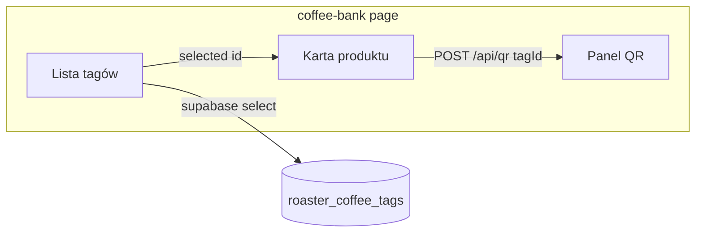

# Plan: Coffee Bank (lista tagów + karta + QR)

## Kontekst danych

- Kawy z formularza na [`apps/web/app/tag/page.tsx`](apps/web/app/tag/page.tsx) trafiają do **`roaster_coffee_tags`** (nie do tabeli `coffees` z [`useRoasterCoffees`](apps/web/src/hooks/useRoasterCoffees.ts)).
- RLS pozwala zalogowanemu użytkownikowi czytać wiersze, gdzie `roaster_id` należy do jego rekordu w `roasters` ([`0008_roaster_coffee_tags_qr.sql`](supabase/migrations/0008_roaster_coffee_tags_qr.sql)).
- **Nazwa kawy w tabeli**: pole **`bean_origin_tradename`** (zgodnie z publicznym podglądem tagu w [`apps/web/app/q/[hash]/page.tsx`](apps/web/app/q/[hash]/page.tsx) — „Trade name”). Sensowny fallback, jeśli puste: np. fragment `bean_origin_farm` lub „Bez nazwy” + skrót `id`, żeby wiersz był rozróżnialny.
- **Data wypału**: `bean_roast_date` (format jak w formularzu — ISO); wyświetlanie przez `date-fns` + locale `pl` (jak na `/tag`).

## Backend / API

- **Brak nowych endpointów REST**: lista przez klienta Supabase (`supabaseBrowser.from('roaster_coffee_tags').select(...)` z filtrem po `roaster_id`).
- **QR**: ponowne użycie [`apps/web/app/api/qr/route.ts`](apps/web/app/api/qr/route.ts) — po wyborze wiersza wywołanie `POST /api/qr` z `{ tagId }` i nagłówkiem `Authorization: Bearer <access_token>` (identyczna logika jak [`handleGenerateQr`](apps/web/app/tag/page.tsx) w `/tag`). Odpowiedź `{ svg, png, url }` — PNG jako `data:image/png;base64,...`, pobieranie SVG jak [`downloadSvg`](apps/web/app/tag/page.tsx) (`qr-${public_hash}.svg`).

## Identyczność kodu QR z pierwszym generowaniem (na `/tag`)

**Ten sam kod ścieżki serwera.** Ponowne wywołanie z Coffee Bank **nie** może używać innej biblioteki ani innych parametrów niż pierwsze generowanie — oba przypadki muszą iść wyłącznie przez [`POST /api/qr`](apps/web/app/api/qr/route.ts). W handlerze URL w kodzie to `${origin}/q/${public_hash}`, przy czym `public_hash` jest **niezmienny** dla wiersza (trigger w migracji). `QRCode.toString` / `toBuffer` używają stałych opcji (`margin: 1`, `width: 256`, ten sam typ PNG/SVG) — przy **identycznym łańcuchu URL** wynik graficzny (SVG/PNG) jest deterministyczny.

**Jedyny realisticzny czynnik rozjazdu** to **różny łańcuch zakodowany w QR**, jeśli **inne jest `origin`** zwracane przez `resolveOrigin(request)` (patrz linie 15–21 w `route.ts`): gdy `NEXT_PUBLIC_APP_URL` jest puste, origin bierze się z nagłówków żądania (`host`, `x-forwarded-*`). Wtedy np. `http://localhost:3000` vs `http://127.0.0.1:3000` lub inny host preview da **inne** QR mimo tego samego `public_hash`.

**Wymóg wdrożeniowy (żeby QR z Coffee Bank = QR z pierwszego razu):**

- Ustawić **`NEXT_PUBLIC_APP_URL`** na **jeden kanoniczny** adres aplikacji w danym środowisku (produkcja / preview / local — tam gdzie ma obowiązywać ten sam link co na druku). Wtedy `resolveOrigin` zawsze zwraca ten sam origin niezależnie od strony (`/tag` vs `/coffee-bank`) i nagłówków przeglądarki.
- Przy implementacji strony Coffee Bank **nie** generować QR po stronie klienta ani nie duplikować logiki z `route.ts` — tylko `fetch('/api/qr', …)` jak na `/tag`.

**QA:** Porównać pole `url` (lub zdekodowany payload QR) z pierwszego generowania i z Coffee Bank — powinny być identyczne przy tej samej konfiguracji env; opcjonalnie snapshot/hash pliku SVG w teście integracyjnym przeciwko stałemu `NEXT_PUBLIC_APP_URL`.

## UI — układ i zachowanie

1. **Powłoka**: `pageShell` / `contentInner` wg wzoru z [`tag.styles.ts`](apps/web/app/tag/tag.styles.ts) (`authWebShellClasses.page`, `max-w-*`, padding).
2. **Siatka dwukolumnowa**: analogicznie do `formGrid` na `/tag` — np. `grid-cols-1` na wąskich ekranach, od `min-[900px]` lub `lg:` dwie kolumny: **lewa** (`min-w-0`) tabela, **prawa** „sticky” karta (opcjonalnie `lg:sticky lg:top-4`) dla wygodnego przewijania długiej listy.
3. **Nagłówek**: `h1` „Coffee Bank”, link powrotu do Roaster Hub (`/roaster-hub`) jak na innych stronach hub.
4. **Bramki**: te same przypadki co na `/tag` — brak sesji → komunikat + link do logowania z `next=/coffee-bank`; brak profilu `roasters` → komunikat + link do `/roaster-hub/setup`.
5. **Tabela sortowalna**:
   - Kolumny: **Nazwa** (`bean_origin_tradename` + fallback), **Data wypału** (`bean_roast_date`).
   - Sortowanie po stronie klienta: stan `sortKey: 'name' | 'roastDate'`, `direction: 'asc' | 'desc'`; `useMemo` na posortowaną listę (daty porównywać jako `Date` / string ISO).
   - Nagłówki klikalne (przyciski lub `role="columnheader"` + `aria-sort`) — przełączanie kierunku przy ponownym kliknięciu tej samej kolumny.
6. **Wybór rekordu (link „z Supabase”)**:
   - Wiersz z **przyciskiem/linkiem** ustawiającym **aktywny** tag po `id`.
   - **Synchronizacja z URL** (zalecane): `searchParams` np. `?tag=<uuid>` — [`useSearchParams`](https://nextjs.org/docs/app/api-reference/functions/use-search-params) + `router.replace` przy wyborze; przy starcie strony odczyt `tag` i zaznaczenie wiersza (oraz walidacja, że id należy do załadowanej listy). Dzięki temu „link” realnie identyfikuje rekord i działa odświeżenie strony.
7. **Prawa kolumna — karta produktu**:
   - Pola z wiersza `roaster_coffee_tags`: m.in. `img_coffee_label`, `roaster_short_name`, pochodzenie, odmiany, obróbka, poziom palenia, `brew_method`, itd. — układ czytelny (sekcje lub lista definicji), spójny wizualnie z kartami z [`tag.styles`](apps/web/app/tag/tag.styles.ts) / [`hub-crud.styles`](apps/web/app/roaster-hub/hub-crud.styles.ts).
   - Stan pusty: gdy nic nie wybrano — krótki komunikat zachęcający do wyboru z tabeli.
8. **QR na dole karty**:
   - Po ustawieniu wyboru (lub przy pierwszym wyświetleniu karty): wywołanie `POST /api/qr`, stany `loading` / `error`, render jak na `/tag`: podgląd SVG (+ opcjonalnie PNG jak w `/tag` — ukryty na `md` dla PNG jeśli zachowujecie ten sam wzorzec).
   - Przycisk **„Pobierz SVG”** — ta sama logika co `downloadSvg` na `/tag`.
   - Przy zmianie wyboru wiersza: wyczyścić poprzedni podgląd QR i ponownie pobrać kod dla nowego `tagId`.

## Style (roaster-app = `apps/web` — bez klas inline w `page.tsx`)

**Źródło prawdy dla wyglądu strony Coffee Bank** wyłącznie pliki stylów utworzone pod aplikację web palarni, w tym:

- **Nowy moduł** [`apps/web/app/coffee-bank/coffee-bank.styles.ts`](apps/web/app/coffee-bank/coffee-bank.styles.ts): eksport obiektu `coffeeBankStyles` z **pełnymi literałami klas** Tailwind (JIT skanuje ten plik — jak [`tag.styles.ts`](apps/web/app/tag/tag.styles.ts), [`hub-crud.styles.ts`](apps/web/app/roaster-hub/hub-crud.styles.ts), [`roaster-profile.styles.ts`](apps/web/app/roaster-profile/roaster-profile.styles.ts)).
- Składanie z **`authWebShellClasses`** i ewentualnie innych eksportów z `@funcup/shared` odbywa się **w pliku `.styles.ts`**, nie w komponencie strony.

**Zakaz w [`page.tsx`](apps/web/app/coffee-bank/page.tsx):**

- **Nie** umieszczać łańcuchów klas Tailwind ani utility inline (`className="…rounded…"` / `` className={`…`} `` z literałami stylów).
- **Tak:** `import { coffeeBankStyles } from './coffee-bank.styles'` oraz wyłącznie **`className={coffeeBankStyles.nazwaKlucza}`** (ew. krótkie `className={`${coffeeBankStyles.a} ${warunek ? coffeeBankStyles.b : coffeeBankStyles.c}`}` gdzie **wszystkie** fragmenty pochodzą z `coffeeBankStyles` — bez dopisywania surowych klas).

**Współdzielony pakiet:** [`packages/shared/src/authWebShellClasses.ts`](packages/shared/src/authWebShellClasses.ts) jest importowany **w module stylów** strony (jak na `/tag`), nie jako powód do pisania nowych literałów w `page.tsx`.

Spójne obramowania, `rounded-[10px]`, kolory tekstu/błędów jak na `/tag` i hub — **zdefiniowane w `coffee-bank.styles.ts`**.

## Warstwa danych (opcjonalny hook)

- Dodać np. [`apps/web/src/hooks/useRoasterCoffeeTags.ts`](apps/web/src/hooks/useRoasterCoffeeTags.ts) z `useQuery` i kluczem `['roaster-coffee-tags', roasterId]`:
  - Pobranie `roaster_id` tak jak na `/tag` (sesja → `roasters.user_id`).
  - Zapytanie: `.from('roaster_coffee_tags').select(<wszystkie pola potrzebne karcie>).eq('roaster_id', roasterId).order('created_at', { ascending: false })` (domyślna kolejność listy; sort w UI i tak nadpisuje kolejność).
- Alternatywa: jeden komponent-rodzic z `useEffect` + `useState` — hook jest czytelniejszy i zgodny z istniejącym [`QueryClientProvider`](apps/web/app/providers.tsx).

## Testy (opcjonalnie, jeśli macie infrastrukturę)

- Krótki test Playwright: zalogowany użytkownik z tagiem — wejście na `/coffee-bank`, widoczna tabela, klik w nazwę, widoczna karta i sekcja QR (można mockować `/api/qr` lub polegać na dev Supabase). Nie jest to konieczne do minimalnej implementacji.

## Pliki do dotknięcia

| Plik | Akcja |
|------|--------|
| [`apps/web/app/coffee-bank/page.tsx`](apps/web/app/coffee-bank/page.tsx) | Pełna implementacja UI + logika wyboru, sortowania, QR |
| `apps/web/app/coffee-bank/coffee-bank.styles.ts` | **Nowy** — klasy Tailwind |
| `apps/web/src/hooks/useRoasterCoffeeTags.ts` | **Nowy** (zalecane) — lista tagów dla palarni |

**Bez zmian** w [`apps/web/app/api/qr/route.ts`](apps/web/app/api/qr/route.ts) dla samej funkcji Coffee Bank — ten sam handler gwarantuje ten sam algorytm co przy pierwszym generowaniu; **identyczność łańcucha w QR** wymaga ustawionego kanonicznego [`NEXT_PUBLIC_APP_URL`](apps/web/app/api/qr/route.ts) (patrz sekcja wyżej). Opcjonalna późniejsza poprawka do `resolveOrigin` (np. tylko env w prod) — poza minimalnym zakresem strony.
