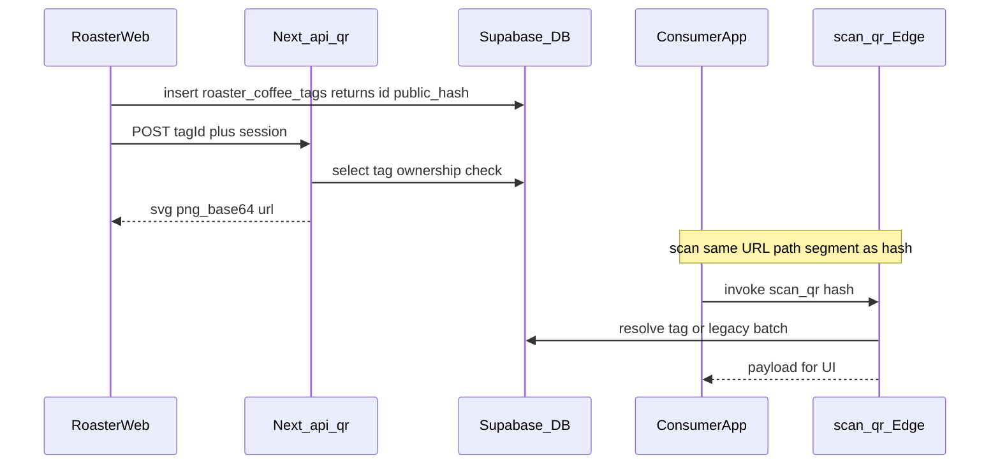

# Plan: self-hosted QR dla `roaster_coffee_tag` (roaster-app web + most do consumer-app)

## Kontekst produktowy

Zgodnie z [qr-generate-roaster.md](dev-docs/Stage%20UI%20prompts/qr-generate-roaster.md): **QR jest jedynym nośnikiem informacji** między palarnią (web) a konsumentem (iOS/Android). Generator musi być **self-hosted w funcup web** ([qr gen prompt 2.md](dev-docs/Stage%20UI%20prompts/qr%20gen%20prompt%202.md)), a kod w QR musi prowadzić do adresu, który **konsument już obsługuje** przez deep link `funcup://q/{hash}` i ekran [apps/consumer-mobile/app/q/[hash].tsx](apps/consumer-mobile/app/q/[hash].tsx) → [apps/consumer-mobile/app/coffee/[id]/index.tsx](apps/consumer-mobile/app/coffee/[id]/index.tsx) + [packages/shared/src/hooks/useCoffeePage.ts](packages/shared/src/hooks/useCoffeePage.ts) (`scan_qr`).

## Luka względem specyfikacji (do domknięcia w kodzie)

| Obszar                                                              | Stan repo                                                                                                                                                                              | Wymagane                                                                                                                                                                                                                                                                                                                                                            |
| ------------------------------------------------------------------- | -------------------------------------------------------------------------------------------------------------------------------------------------------------------------------------- | ------------------------------------------------------------------------------------------------------------------------------------------------------------------------------------------------------------------------------------------------------------------------------------------------------------------------------------------------------------------- |
| Tabela `roaster_coffee_tags`                                        | [0005_roaster_coffee_tags.sql](supabase/migrations/0005_roaster_coffee_tags.sql): brak `public_hash`, brak powiązania z roasterem                                                      | Migracja: `public_hash` (TEXT UNIQUE NOT NULL, domyślnie np. `gen_random_uuid()::text` lub osobny trigger), kolumna **ownership** (np. `roaster_id uuid REFERENCES roasters(id)`) — walidacja w [qr gen prompt 2.md](dev-docs/Stage%20UI%20prompts/qr%20gen%20prompt%202.md) sensowniej jako `roasters.user_id = auth.uid()` + `tag.roaster_id`                     |
| Zapis tagu z [apps/web/app/tag/page.tsx](apps/web/app/tag/page.tsx) | Anon insert przez [supabaseBrowser](apps/web/app/tag/page.tsx); komentarz w migracji: dev RLS                                                                                          | Żeby `POST /api/qr` miał sens, zapis musi ustawiać `roaster_id` (i sesja roastera musi być dostępna). Opcje: (a) wymagać zalogowanego roastera przed `/tag`, (b) tymczasowo łagodna polityka dev — **rekomendacja: (a)** zgodnie z docem auth                                                                                                                       |
| Konsument                                                           | [useCoffeePage](packages/shared/src/hooks/useCoffeePage.ts) → wyłącznie kształt batch z `scan_qr`; [scan-qr.ts](supabase/functions/qr/scan-qr.ts) waliduje **UUID** i szuka `qr_codes` | Rozszerzyć `scan_qr`: jeśli brak w `qr_codes`, szukać `roaster_coffee_tags` po `public_hash`; poluzować lub rozdzielić walidację formatu hasha; zwrócić **discriminated payload** (`kind: 'batch' | 'tag'`) albo wspólny adapter — oraz zaktualizować UI mobile (minimum: gałąź „tag” z polami z tagu zamiast batch/coffee MVP)                                     |
| Web `/q/[hash]`                                                     | [apps/web/app/q/[hash]/page.tsx](apps/web/app/q/[hash]/page.tsx) woła `scan_qr` i pokazuje batch                                                                                       | Ujednolicić z mobile: ten sam kontrakt co po zmianie `scan_qr`, albo Server Component pobierający tag publicznie (jeśli wprowadzicie publiczny odczyt tagu po hash — wymaga RLS **SELECT** dla anon na wierszach „opublikowanych” lub wyłącznie przez Edge service role — dziś [dev_anon_select](supabase/migrations/0005_roaster_coffee_tags.sql) na `true` w dev) |

## 1. Warstwa danych (Supabase)

- Nowa migracja SQL:
  - `public_hash` + unikalny indeks; wartość ustawiana **przy INSERT** (DEFAULT lub trigger `BEFORE INSERT`), **immutable** (brak UPDATE `public_hash` — enforced triggerem lub brakiem uprawnień).
  - `roaster_id uuid NOT NULL REFERENCES roasters(id)` (lub nullable tylko jeśli musicie migrować istniejące wiersze — wtedy backfill + `NOT NULL`).
- RLS: zastąpić dev-anon na produkcyjny wzorzec: INSERT/SELECT/UPDATE tylko dla właściciela (przez `roasters.user_id = auth.uid()`). Zakres można rozłożyć na dwa PR (najpierw kolumny + trigger hash, potem RLS), ale **endpoint `/api/qr` zakłada zweryfikowanego użytkownika**.
- Zaktualizować typy: [packages/types/src/roasterCoffeeTag.ts](packages/types/src/roasterCoffeeTag.ts), [supabase/types/database.ts](supabase/types/database.ts) (regeneracja jeśli macie skrypt), [clientFormValuesToInsert](packages/shared/src/validation/roasterCoffeeTagForm.ts) — **nie** wkładać `public_hash` z klienta; serwer/DB generuje.

## 2. `POST /api/qr` (Next.js, Node runtime)

- Plik: [apps/web/app/api/qr/route.ts](apps/web/app/api/qr/route.ts) (folder utworzyć).
- `export const runtime = 'nodejs'` (jawnie Node, zgodnie ze spec).
- Body: `{ tagId: string }` (JSON), walidacja UUID jeśli `id` jest uuid.
- Auth: `createServerClient` / helper istniejący w web (sprawdzić wzorce w repo) + `getUser()`; brak sesji → 401.
- Odczyt tagu z Supabase **service role po stronie serwera** lub klient z cookies sesji + RLS — preferencja: **sesja użytkownika + RLS** jeśli polityki pozwalają roasterowi czytać własne tagi; inaczej service role + ręczny check `roaster_id` join `roasters`.
- Odpowiedź: `{ svg: string, png: string (base64), url: string }` gdzie `url` = `{origin}/q/{public_hash}`; `origin` z `NEXT_PUBLIC_APP_URL` lub nagłówka `x-forwarded-host` / `Host` (udokumentować env dla staging).
- Biblioteka QR: np. `qrcode` (PNG buffer + SVG string) — dodać zależność w [apps/web/package.json](apps/web/package.json).
- Błędy: 404 (brak tagu), 403 (cudzy tag), 400 (walidacja).

## 3. UI roaster: [apps/web/app/tag/page.tsx](apps/web/app/tag/page.tsx)

- **Układ (zsynchronizuj z DoD)**: formularz + panel QR: **≥480px** — SVG po **prawej**; **&lt;480px** — SVG **pod** formularzem; bez sticky na start (wg wcześniejszej spec).
- **Flow przycisków** (copy przez i18n jeśli macz już mechanizm; inaczej stałe na raz z TODO):
  1. Submit: „Zapisz dane” (obecne „Zapisz w Supabase” → ujednolicić z promptem).
  2. Po sukcesie: komunikat sukcesu + **drugi stan** przycisku „Generuj kod QR” (nie drugi submit tego samego formularza — osobny `button type="button"` z `tagId` z odpowiedzi insert `select('id, public_hash')`).
  3. Po kliknięciu: `fetch('/api/qr', { method: 'POST', credentials: 'include', headers: { Authorization: Bearer … } })` — dokładny mechanizm musi być spójny z tym, jak web przekazuje JWT do Route Handler (cookies Supabase vs Bearer z `getSession()`).
  4. Wynik: **obowiązkowo widoczny podgląd SVG** (inline / `img` z `data:image/svg+xml` / bezpieczny embed) spełniający DoD; opcjonalnie PNG z odpowiedzi API + przycisk pobrania SVG (Blob + `download`).
- Usunąć/zmienić dev-only copy o Studio, jeśli przeszkadza w produktowym flow (opcjonalnie zostawić za `NODE_ENV`).

## 4. Rozwiązywanie hasha dla konsumenta i web `/q`

- **[supabase/functions/qr/scan-qr.ts](supabase/functions/qr/scan-qr.ts)** (lub entrypoint [supabase/functions/scan_qr](supabase/functions) jeśli to inny plik — zweryfikować faktyczny deploy): dodać ścieżkę „tag po `public_hash`”, zwracać JSON zrozumiały dla shared hooka.
- **[packages/shared/src/hooks/useCoffeePage.ts](packages/shared/src/hooks/useCoffeePage.ts)**: typ zwracany jako union; `queryFn` zwraca zunifikowany model lub dwa typy i `CoffeePage` rozgałęzia.
- **[apps/consumer-mobile/app/coffee/[id]/index.tsx](apps/consumer-mobile/app/coffee/[id]/index.tsx)**: render dla `kind === 'tag'` (etykieta, pochodzenie, obróbka, data wypału itd. z kolumn tagu); dla batch — istniejący layout.
- **[apps/web/app/q/[hash]/page.tsx](apps/web/app/q/[hash]/page.tsx)**: to samo rozróżnienie co mobile (lub uproszczony widok tagu).

## 5. Wycofanie `generate_qr` (Edge)

- Usunąć lub wyłączyć funkcję w [supabase/config.toml](supabase/config.toml) i katalog `supabase/functions/generate_qr`.
- Zastąpić lub usunąć [apps/web/app/dashboard/coffees/[id]/batches/[batchId]/QRDownloadButton.tsx](apps/web/app/dashboard/coffees/[id]/batches/[batchId]/QRDownloadButton.tsx) (pełne zastąpienie zaakceptowane na tym etapie).
- Zaktualizować [apps/web/tests/generate-qr.spec.ts](apps/web/tests/generate-qr.spec.ts) → testy przeciwko `POST /api/qr` (lokalny Next + mock auth / seed roaster + tag).

## 6. Testy i dokumentacja

- Unit/integration: handler `/api/qr` (ownership, 404, poprawny URL).
- E2E (Playwright): opcjonalnie pełna ścieżka od pierwszego loadu (splash → rola roaster → tag → generacja) lub minimum zapis tagu → generacja → asercja widocznego SVG i layoutu; zgodnie z DoD.
- Krótka aktualizacja kontraktu w `dev-docs/specs` (opcjonalnie), żeby nie rozjeżdżać się z [edge-function-generate-qr.md](dev-docs/specs/002-qr-coffee-platform/contracts/edge-function-generate-qr.md).

## Definition of Done (DoD)

Kryterium uznania tej funkcji za ukończoną — **ścieżka end-to-end od pierwszego wejścia**, bez pomijania etapów onboardingowych.

1. **Animated-splash (kontrakt obowiązkowy)**  
   - Aplikacja web startuje tak jak dziś: użytkownik widzi [AnimatedSplash](apps/web/components/AnimatedSplash.tsx) w ramach [AppOpenGate](apps/web/components/AppOpenGate.tsx) (pierwsze zamontowanie root layoutu → `onFinish` → dalsza nawigacja).  
   - **Żadna zmiana w tej funkcji nie może łamać tego kontraktu**: splash nadal odpala się zgodnie z obecną logiką (czas animacji, `onFinish`, brak „migania” lub pomijania bramy przy przejściach na `/role`, `/tag` itd.). Jeśli dodajesz middleware/redirecty/layout — weryfikuj, że splash nie jest podwójnie montowany ani pomijany wbrew intencji `AppOpenGate`.

2. **Wybór roli `roaster`**  
   - Po zakończeniu splash użytkownik przechodzi ścieżką produktową do wyboru roli i wybiera **`roaster`** (jak w aktualnym flow `roaster-app`).

3. **Wypełnienie i zapis `roaster-coffee-tag` do Supabase**  
   - `roaster` wypełnia formularz tagu kawy i wysyła zestaw danych do Supabase (insert `roaster_coffee_tags` z prawidłowym ownership zgodnie z implementacją); zapis kończy się sukcesem (np. komunikat sukcesu / stan gotowości do kroku 4).

4. **Generacja po zmianie stanu + podgląd SVG + responsywny layout**  
   - Po sukcesie zapisu UI przechodzi w stan, w którym **inny** krok interakcji (przycisk po zmianie stanu/napisu, zgodnie z flow „Zapisz → Generuj”) wywołuje serwer (`POST /api/qr` lub ekwiwalent); serwer zwraca **SVG** kodu QR.  
   - SVG jest **widoczny** w układzie strony tag:  
     - **viewport ≥ 480px (szerokie)**: podgląd QR po **prawej** stronie względem formularza `roaster-coffee-tag` (dwukolumnowy layout).  
     - **viewport &lt; 480px**: ten sam podgląd SVG **pod** formularzem (jedna kolumna).  
   - DoD wymaga widocznego **SVG** (nie wystarczy sam plik do pobrania bez preview); przycisk pobrania SVG może pozostać jako uzupełnienie zgodnie z wcześniejszą specyfikacją.

**Weryfikacja:** ręczny przebieg 1→4 oraz (jeśli istnieje) test E2E lub checklista QA dokumentująca zachowanie splash przy wejściu na `/tag` po wyborze roli.

## Ryzyka / zależności

- **Auth na `/tag`**: bez zalogowanego roastera i `roaster_id` na wierszu endpoint zawsze zwróci 403 — trzeba dodać krok „login roaster” przed wejściem na `/tag` lub jasny komunikat.
- **Spójność hasha**: jeśli `public_hash` nie jest UUID, **zmienić** walidację w `scan_qr` (obecnie tylko UUID).
- **Rozmiar QR**: URL produkcyjny vs staging — konfiguracja `NEXT_PUBLIC_APP_URL`.

