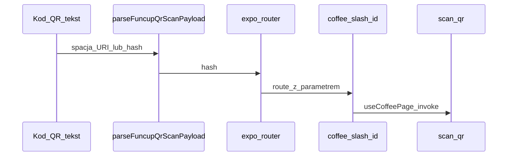

# Prompt startowy (Composer 2) — consumer-app: skan QR na Coffee Hub

## Jak używać tego dokumentu

Na początku sesji wklej agentowi (Composer): **„Wykonaj zadania z pliku `.cursor/plans/stan_funcup_+_consumer_scan_fd71f752.plan.md`, sekcja Instrukcje dla agenta.”**  
Agent ma traktować poniższą sekcję jako **binding checklist** — kolejność ma znaczenie tam, gdzie jest numeracja.

---

## Kontekst produktowy (skrót)

- **funcup** = dwie aplikacje: `roaster-app` tylko web (`apps/web`), `consumer-app` tylko mobile (`apps/consumer-mobile`). Wymiana danych przez **kod QR** (model self-hosted: QR generuje palarnia).
- **Ten sprint:** domknąć **skaner QR** na mobile tak, aby odczyt z kodu wygenerowanego w roaster-app prowadził do tej samej treści co przeglądarka pod `/q/{public_hash}` — przez istniejący Edge **`scan_qr`** i hook **`useCoffeePage`**.

---

## Stan roaster-app (`apps/web`) — na dziś (referencja, nie zakres prac)

Zrealizowane m.in.: auth, `/role`, `/roaster-profile`, `/roaster-hub` + setup + CRUD kaw/batchy + analityka, **`/tag`** (zapis `roaster_coffee_tags`, upload etykiety, **`POST /api/qr`**), **`/coffee-bank`**, web **`/q/[hash]`** → `scan_qr`, przekierowania `/dashboard` → `/roaster-hub`, pakiety współdzielone `packages/shared`, `packages/types`, E2E m.in. QR i coffee-bank.

*(Jeśli aktualizujesz dokumentację tras: plik `.cursor/plans/routes and sites update.md` jest nieaktualny względem Coffee Bank — można go poprawić przy okazji.)*

---

## Instrukcje dla agenta

### Faza 0 — przygotowanie (zrób przed pierwszą linijką kodu)

1. **Monorepo:** upewnij się, że `pnpm install` w korzeniu repo jest wykonane; workspace `@funcup/shared` musi być linkowany do `apps/consumer-mobile`.
2. **Supabase + mobile:** zweryfikuj, że `apps/consumer-mobile` ma ustawione **`EXPO_PUBLIC_SUPABASE_URL`** i **`EXPO_PUBLIC_SUPABASE_ANON_KEY`** (lub że fallbacki w [`app.config.ts`](apps/consumer-mobile/app.config.ts) są świadomie używane tylko do lokalnego dev). **Ten sam projekt Supabase** musi zawierać dane tagów skanowanych z QR wygenerowanego przez roaster-app.
3. **Przepływ referencyjny (do ręcznego testu po implementacji):**
   - Uruchom `apps/web` (`pnpm -C apps/web dev`), zaloguj palarnię, na **`/tag`** zapisz tag i wygeneruj QR (**Generuj kod QR**).
   - Uruchom consumer (`pnpm -C apps/consumer-mobile start` → iOS Simulator / Android / urządzenie).
   - Oczekiwany efekt końcowy: zeskanowanie kodu otwiera w aplikacji **tę samą** treść tagu co wejście w przeglądarce na `/q/{public_hash}`.
4. **Czytaj przed edycją:** [`packages/shared/src/hooks/useCoffeePage.ts`](packages/shared/src/hooks/useCoffeePage.ts), [`apps/consumer-mobile/app/q/[hash].tsx`](apps/consumer-mobile/app/q/[hash].tsx), [`apps/consumer-mobile/app/coffee/[id]/index.tsx`](apps/consumer-mobile/app/coffee/[id]/index.tsx), [`apps/web/app/api/qr/route.ts`](apps/web/app/api/qr/route.ts) (format URL w QR: `{origin}/q/{public_hash}`).

### Faza 1 — parsowanie łańcucha z QR (współdzielone + testy)

1. W **`packages/shared`** dodaj funkcję (nazwa robocza: `parseFuncupQrScanPayload`), która z **jednego stringa** zwraca **`public_hash`** lub `null`:
   - sam hash (identyfikator jak w `public_hash` w bazie),
   - pełny URL `http(s)://…/q/{hash}`,
   - deep link `funcup://q/{hash}` (zgodnie ze [`scheme` w app.config](apps/consumer-mobile/app.config.ts)).
2. **Nie** duplikuj logiki resolvowania batch vs tag — to robi Edge `scan_qr`; parser tylko **wydobywa hash** z tekstu QR.
3. Eksportuj z paczki zgodnie z konwencją [`packages/shared/src/index.ts`](packages/shared/src/index.ts).
4. Dodaj **testy jednostkowe** (Vitest w repo — użyj istniejącego wzorca w `packages/shared`) dla kilku przykładów: sam hash, URL z portem localhost, URL produkcyjny, `funcup://`, negatywne przypadki.

### Faza 2 — ekran skanera (Expo)

1. Zastąp placeholder w [`apps/consumer-mobile/app/(tabs)/hub/scan.tsx`](apps/consumer-mobile/app/(tabs)/hub/scan.tsx).
2. Użyj **`expo-camera`** (już w [`package.json`](apps/consumer-mobile/package.json)) — API zgodne z **Expo SDK 54** / dokumentacją (np. `CameraView`, skan kodów kreskowych/QR).
3. Obsłuż **uprawnienia kamery** (stan: nie wyświetlaj podglądu bez zgody; komunikat zrozumiały dla użytkownika).
4. Po poprawnym odczycie: wywołaj parser z Fazy 1; przy sukcesie **`router.replace`** do **`/q/[hash]`** z parametrem `hash` (jedna ścieżka wejścia — nie dublować nawigacji do `/coffee/[id]` równolegle).
5. Błędy: niepoprawny format QR — komunikat na ekranie, możliwość ponowienia skanu.
6. Opcjonalnie **`__DEV__`:** zostaw pole do wklejenia URL/hash dla debugu bez kamery (jak obecny prototyp), ukryj lub ogranicz do dev.

### Faza 3 — konfiguracja native

1. W [`apps/consumer-mobile/app.config.ts`](apps/consumer-mobile/app.config.ts) dodaj plugin **`expo-camera`** w tablicy `plugins`, tak aby na **iOS** pojawił się sensowny **`NSCameraUsageDescription`**, a na **Android** uprawnienie kamery było deklarowane — inaczej release/TestFlight zawiedzie.

### Faza 4 — Coffee Hub (minimalnie)

1. Upewnij się, że CTA z [`hub/index.tsx`](apps/consumer-mobile/app/(tabs)/hub/index.tsx) nadal prowadzi do działającego **`hub/scan`**. Refactor stylów hubu do `*.styles.ts` **nie jest** częścią minimalnego Done — tylko jeśli użytkownik poprosi w tej samej sesji.

### Kryteria akceptacji (Definition of Done)

- [ ] Parser + testy jednostkowe przechodzą w CI / `pnpm` test w paczce shared.
- [ ] Na iOS **lub** Android: po skanie QR z `/tag` (web) otwiera się ekran kawy z danymi tagu (spójnie z web `/q/{hash}`).
- [ ] Uprawnienia kamery działają po czystym buildzie (`prebuild` / dev client jeśli używany).
- [ ] Brak regresji: deep link `funcup://q/{hash}` (jeśli skonfigurowany) nadal działa z [`app/q/[hash].tsx`](apps/consumer-mobile/app/q/[hash].tsx).

### Poza zakresem tego sprintu

- Nowe ekrany poza skanem i minimalnym hubem; pełny design system mobile; logowanie konsumenta; sklep.
- Zmiana kontraktu Edge `scan_qr` (chyba że napotkasz bug — wtedy opisz w PR).

### Ryzyka (miej na uwadze)

- QR enkoduje **pełny URL**, nie „goły” UUID — parser musi wyciągnąć segment **`/q/{hash}`**.
- **Ten sam Supabase** na mobile co dane wygenerowane przez roaster-app; niedopasowanie env = puste błędy przy `scan_qr`.

---

## Diagram przepływu (referencja)

