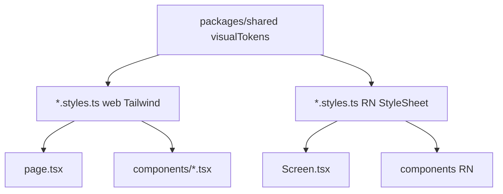

# Plan refaktoringu stylów (najlżejszy wariant) — do zatwierdzenia

## Cel

- Wyprowadzić style z plików routingu (`page.tsx` na webie) i ekranów RN tak, by zawierały głównie logikę + JSX.
- Współdzielić **wyłącznie surowe wartości** (kolory, odstępy, promienie) przez jeden eksport w monorepo.
- **Bez** dodatkowych warstw typu `createWebStyles` / `createNativeStyles` i bez rozbudowanego łańcucha theme → adapter.

### Cel dodatkowy (zakres „maksymalne odsłonięcie” kodu wykonywalnego)

- Z **`page.tsx`** oraz z **komponentów** (`apps/web/src/components/**`, `apps/web/app/**` poza `page` jeśli zawierają style inline / długie `className`, oraz odpowiedniki w `apps/consumer-mobile`) **usunąć możliwie najwięcej kodu stylów** — przenieść go do sąsiednich `*.styles.ts` (web) lub `*.styles.ts` z `StyleSheet.create` (RN), ewentualnie do **kolokowanych** plików `NazwaKomponentu.styles.ts` obok `NazwaKomponentu.tsx`.
- W plikach wykonywalnych **zostaje wyłącznie**: hooki, stan, handlery zdarzeń, warunki renderu, kompozycja JSX, importy stylów, ewentualnie krótkie `className={styles.x}` / `style={styles.x}` wskazujące na **klucz** z mapy stylów (bez literalów kolorów, `px`, `#hex`, długich łańcuchów Tailwind w JSX).
- **Dopuszczalne wyjątki** (minimalne, uzasadnione w review): `data-testid`, krótkie `aria-*`, pojedyncze `cn(styles.a, condition && styles.b)` gdy logika warunku należy do UI — bez duplikowania w JSX surowych tokenów.

## Niegroźne poza zakresem (świadomie później)

- Pełna migracja `apps/web/app/tag/page.tsx` (~700 linii) w jednym PR.
- Usunięcie Tailwinda z całego `apps/web`.
- Dark mode (opcjonalnie: drugi zestaw tokenów w osobnej fazie).

---

## Faza 0 — zasady (konwencja)

| Platforma | Plik | Zawartość |
|-----------|------|-----------|
| **Web** | `*.styles.ts` obok `page.tsx` lub obok komponentu (np. `Foo.styles.ts` przy `Foo.tsx`) | Stałe stringi klas Tailwind (wzorzec jak `apps/web/src/theme/authScreenStyles.ts`). |
| **RN** | `*.styles.ts` przy ekranie / przy komponencie / w `src/theme/` | `StyleSheet.create({ ... })` z polami czytanymi z tokenów. |

- `page.tsx`, `Screen.tsx`, komponenty: tylko `import { …Styles } from './….styles'` (względna ścieżka kolokacji) — bez nowych wrapperów.
- **Priorytet refaktoru:** najpierw pliki o największej gęstości stylów w JSX (długie `className`, `style={{ ... }}`, `StyleSheet.create` wewnątrz komponentu) — żeby szybko zmniejszyć szum w kodzie wykonywalnym.

---

## Faza 1 — tokeny (SSoT wartości)

1. Dodać `packages/shared/src/visualTokens.ts` z obiektem `visualTokens` (`as const`): kolory i metryki zsynchronizowane z obecnymi wartościami w:
   - `apps/web/src/theme/authScreenStyles.ts`
   - `apps/consumer-mobile/src/theme/authScreenStyles.ts`
2. Eksport w `packages/shared/src/index.ts` (`export * from './visualTokens'`).
3. **Reguła:** w tokenach tylko literały — brak React / RN / Next.

---

## Faza 2 — migracja falami

### Fala A (pilot, jeden mały PR)

- **Web:** `apps/web/app/role/role.styles.ts`, `apps/web/app/roaster-hub/roaster-hub.styles.ts` — przenieść łańcuchy Tailwind z `page.tsx`; strony tylko importują.
- **RN:** wewnętrzna refaktoryzacja `apps/consumer-mobile/src/theme/authScreenStyles.ts` tak, by wartości pochodziły z `visualTokens` (bez zmiany publicznego kształtu eksportu, jeśli możliwe — mniej ryzyka dla istniejących importów).

### Fala B

- `apps/web/app/roaster-profile/page.tsx` → `roaster-profile.styles.ts` (+ ewentualnie podkomponenty w tym samym segmencie routingu).

### Fala C (największa)

- `apps/web/app/tag/page.tsx` — **sekcja po sekcji** lub wycięcie podkomponentów z własnymi `*.styles.ts` (unik jednego pliku 800+ linii samych stylów).

### Fala D

- Pozostałe strony z inline `style={{ … }}` lub długimi `className` w `app/` (np. `roaster-hub/setup`, `roaster-hub/coffees/*`, `(auth)/login`) — osobne `*.styles.ts`.

### Fala E (komponenty, równolegle lub po D)

- Przejść **`apps/web/src/components/**`** (oraz ewentualne komponenty tylko pod `app/`): wyciąć `StyleSheet.create` z ciała komponentu, długie `className`, obiekty `style={{ ... }}` do `Nazwa.styles.ts`.
- Na **Expo:** analogicznie `apps/consumer-mobile/src/components/**` i ekrany poza już ogarniętym `authScreenStyles`.
- Kryterium „gotowe”: w pliku `.tsx` nie ma literalów wizualnych (`#…`, `rgb`, liczby `px` w JSX), o ile da się je sensownie nazwać w mapie stylów.

---

## Definition of Done (po Fali A)

- `visualTokens` jest w `@funcup/shared` i użyty w pilocie web + w RN `authScreenStyles`.
- `role` i `roaster-hub` (web) nie trzymają długich łańcuchów Tailwind w `page.tsx`.
- Brak nowych zależności npm.

## Definition of Done (cały plan — docelowo)

- **Strony:** wszystkie wskazane w falach `page.tsx` (web) spełniają zasady sekcji „kod wykonywalny” (powyżej).
- **Komponenty:** po Falach D–E znacząca część drzewa UI bez inline stylów; pozostałości tylko jako jawne wyjątki w review.
- Tokeny pozostają jedynym źródłem powtarzalnych wartości liczbowych/kolorów między web a RN.

---

## Ryzyka

- **Tailwind JIT:** unikać składania klas z template stringiem z samego `visualTokens` w sposób niewidoczny dla skanera treści — bezpieczniej trzymać pełne stringi klas w `.styles.ts` (wartości tokenów można wkleić do stałych obok, żeby SSoT był w jednym miejscu w TS).

---

## Diagram

---

## Status wykonania (2026-04-28)

| Element | Stan |
|---------|------|
| Faza 1 — `visualTokens.ts`, eksport, test spójności z `authWebShellClasses` | Zrobione |
| `authWebShellClasses.ts` w shared + `tailwind.config` content na `packages/shared/src` | Zrobione |
| Web `authScreenStyles` → re-export z `@funcup/shared` | Zrobione |
| Fala A — `role.styles.ts`, `roaster-hub.styles.ts`, RN `authScreenStyles` + strony | Zrobione |
| Fala B — `roaster-profile.styles.ts` + `page.tsx` | Zrobione |
| Fala C — `tag/page.tsx` + `tag.styles.ts` | Zrobione |
| Fala D — `roaster-hub/*`, `hub-crud.styles.ts`, `(auth)/auth-pages.styles.ts`, `q/resolve-hash.styles.ts` | Zrobione (web `app/` bez `style={{}}`) |
| Fala E — web: `src/components/analytics/*.styles.ts`; RN: `consumer-mobile/src/components/**` | Zrobione |
