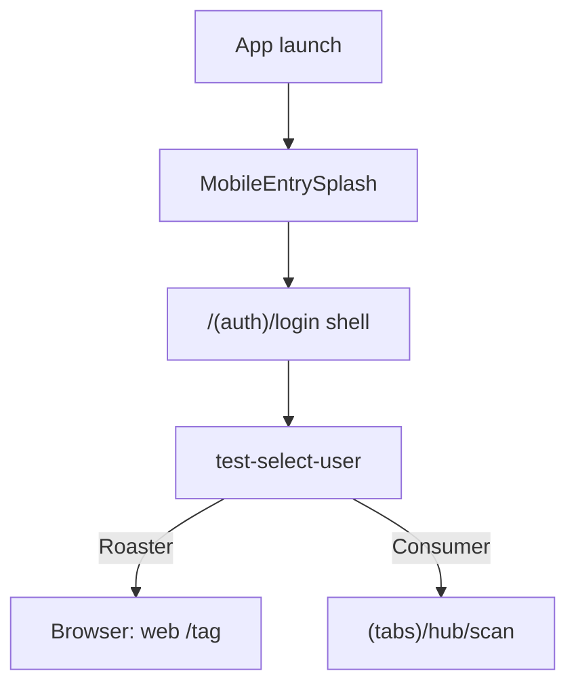
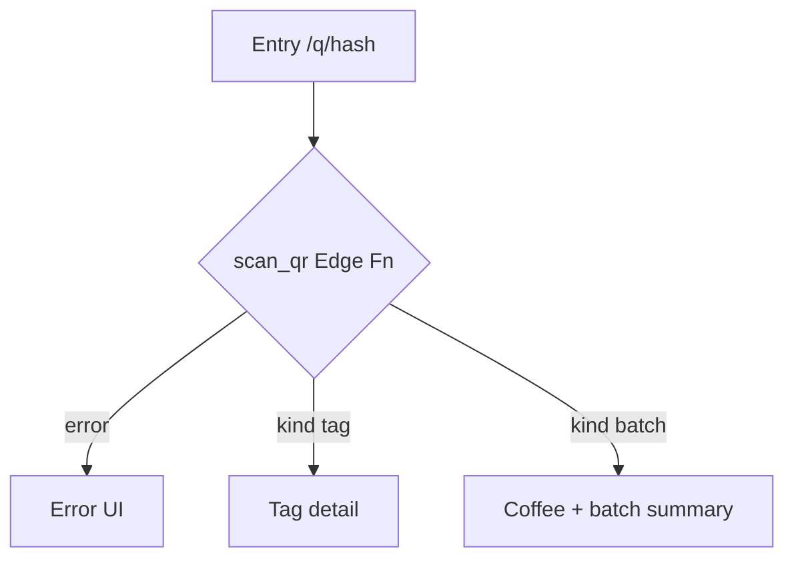
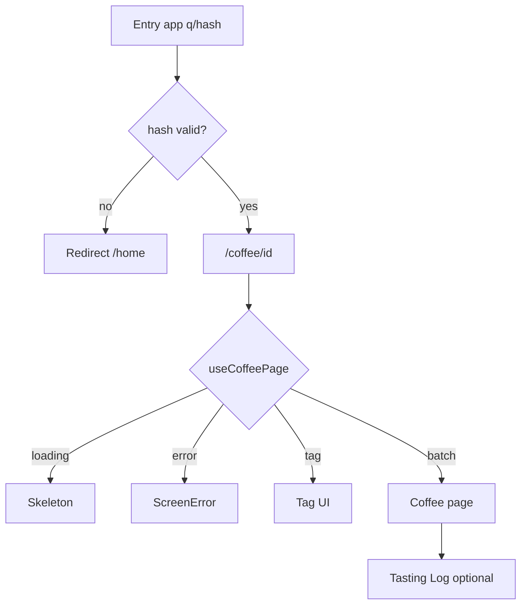
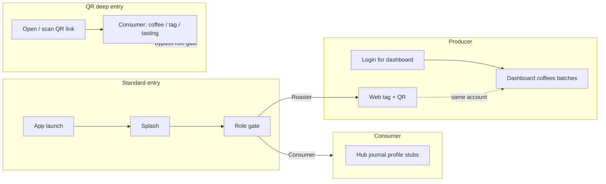

# Mapowanie flowów Funcup — wynik (UX-first, routing)

**Źródło zadania:** [route-check-210426-prompt.md](./route-check-210426-prompt.md)  
**Stan kodu:** inwentaryzacja wykonana względem repozytorium (Next.js App Router + Expo Router + Supabase).

---

## Etap 1 — Inwentaryzacja routingu

### `apps/web` — `app/**/page.tsx`

| Ścieżka URL | Plik |
|-------------|------|
| `/` | `app/page.tsx` |
| `/role` | `app/role/page.tsx` |
| `/login` | `app/(auth)/login/page.tsx` |
| `/register` | `app/(auth)/register/page.tsx` |
| `/pending` | `app/(auth)/pending/page.tsx` |
| `/home` | `app/home/page.tsx` |
| `/scan` | `app/scan/page.tsx` |
| `/hub` | `app/hub/page.tsx` |
| `/profile` | `app/profile/page.tsx` |
| `/tag` | `app/tag/page.tsx` |
| `/q/[hash]` | `app/q/[hash]/page.tsx` |
| `/dashboard/coffees` | `app/dashboard/coffees/page.tsx` |
| `/dashboard/coffees/new` | `app/dashboard/coffees/new/page.tsx` |
| `/dashboard/coffees/[id]` | `app/dashboard/coffees/[id]/page.tsx` |
| `/dashboard/coffees/[id]/batches/new` | `app/dashboard/coffees/[id]/batches/new/page.tsx` |
| `/dashboard/coffees/[id]/batches/[batchId]` | `app/dashboard/coffees/[id]/batches/[batchId]/page.tsx` |
| `/dashboard/analytics/[batchId]` | `app/dashboard/analytics/[batchId]/page.tsx` |
| `/dashboard/roaster/setup` | `app/dashboard/roaster/setup/page.tsx` |

### `apps/web` — `app/**/route.ts`

| Metoda + ścieżka | Plik |
|-----------------|------|
| `POST /api/qr` | `app/api/qr/route.ts` |

### Middleware Next.js

Brak pliku `middleware.ts` w repozytorium — **nie ma** centralnej warstwy przechwytującej żądania na poziomie Edge.

### `apps/consumer-mobile` — Expo Router (ekrany)

Ścieżki logiczne (pliki w `app/`): `index`, `home`, `test-select-user`, `q/[hash]`, `coffee/[id]/index`, `coffee/[id]/log`, `(auth)/login`, `(auth)/login-form`, `(auth)/register`, `(tabs)/hub`, `(tabs)/hub/scan`, `(tabs)/journal`, `(tabs)/profile`, `learn/[slug]`, `roaster/[id]`, `+native-intent`, layouti `_layout.tsx`.

---

## Etap 1 — Grupowanie (kategorie produktowe)

| Kategoria | Web | Mobile |
|-----------|-----|--------|
| **Public / deep link** | `/q/[hash]` | `q/[hash]` → przekierowanie do `coffee/[id]` |
| **Consumer (hub / makiety)** | `/scan`, `/home`, `/hub`, `/profile` | `(tabs)/*`, `home`, scan, strona kawy, log degustacji |
| **Producer (roaster)** | `/tag`, `/dashboard/**` | Wybór Roaster otwiera **przeglądarkę** na web `/tag` (`EXPO_PUBLIC_ROASTER_WEB_URL`) |
| **Auth** | `/login`, `/register`, `/pending` | `(auth)/*` + pośrednik `login` → bramka ról |
| **Entry / gate** | `/`, `/role` + `AppOpenGate` w root layout | Splash (`index`) → `/(auth)/login` → `test-select-user` |
| **API** | `POST /api/qr` | — |

---

## Etap 2 — Zidentyfikowane flowy (UX)

### F1 — Web: standardowy start

- **Entry:** otwarcie aplikacji w przeglądarce.
- **Kroki:** `AppOpenGate` pokazuje `AnimatedSplash`; po zakończeniu renderowane są dzieci layoutu — `/` wykonuje `replace('/role')`. Na `/role`: Roaster → `/tag`, Consumer → `/scan`; opcjonalnie link do `/login`.
- **Exit:** wejście w ścieżkę Roaster, Consumer lub logowanie.
- **Uwaga:** `/home` to osobny hub (komentarz „Previous root home”) i **nie** jest domyślnym celem po splashu.

### F2 — Mobile: standardowy start

- **Entry:** uruchomienie aplikacji.
- **Kroki:** `MobileEntrySplash` → `router.replace('/(auth)/login')` → ekran `login.tsx` natychmiast `replace('/test-select-user')`. Roaster: `Linking.openURL` na web `/tag`. Consumer: `(tabs)/hub/scan`.
- **Exit:** jak wyżej; Roaster działa poza aplikacją mobilną (web).

### F3 — Deep link QR (web)

- **Entry:** `/q/{hash}`.
- **Kroki:** klient woła Supabase Function `scan_qr`; sukces → widok **tagu** lub **batch + coffee**; błąd → komunikat.
- **Exit:** przeczytana treść lub błąd.
- **Uwaga:** omija bramkę ról.

### F4 — Deep link QR (mobile)

- **Entry:** deep link (np. `funcup://q/{hash}`).
- **Kroki:** `q/[hash].tsx` przekierowuje na `/coffee/[id]` z `id = hash`; `useCoffeePage` — wariant **tag** vs pełna strona kawy z linkiem do **Tasting Log**.
- **Exit:** przeglądanie / log degustacji / błąd (brak `id`, sieć, parsowanie).

### F5 — Auth (web)

- **Entry:** `/register`, `/login` (lub redirect z dashboardu).
- **Kroki:** `signUp` → `/pending`; `signInWithPassword` → `?next=` lub `/dashboard/coffees`.
- **Exit:** konto + ewent. weryfikacja e-mail; sesja i nawigacja dalej.

### F6 — Producer: dashboard kaw

- **Entry:** `/dashboard/coffees`.
- **Kroki:** sprawdzenie sesji; brak usera → `/login`; błąd „brak profilu palarni” → `/dashboard/roaster/setup`. Lista → szczegóły → partie / analytics.
- **Exit:** zarządzanie danymi lub przerwanie (auth / brak roastera).

### F7 — Producer: tag + generowanie QR (`/tag` + API)

- **Entry:** `/tag` (z bramki lub po setupie).
- **Kroki:** formularz, upload etykiety, zapis; `POST /api/qr` z JWT dla podglądu kodu QR.
- **Exit:** zapisany tag + materiały QR lub błąd.

### F8 — Consumer web z bramki (`/scan`)

- **Entry:** Consumer z `/role`.
- **Kroki:** strona informacyjna „Skanuj QR” — **bez** integracji kamery w kodzie.
- **Exit:** tylko UI placeholder (flow skanowania **niekompletny**).

### F9 — Consumer mobile: ekran scan (makieta)

- **Entry:** `(tabs)/hub/scan`.
- **Kroki:** `TextInput` z hashem + link do `/coffee/[id]` — **nie** prawdziwy skaner w tym pliku.
- **Exit:** ręczne wejście hasha lub przejście z linku.

---

## Niejasności, luki, sprzeczności

1. Trasa mobilna `/(auth)/login` **nie** jest ekranem logowania — tylko przekierowanie do bramki ról; nazwa może wprowadzać w błąd.
2. Roaster na mobile = **wyjście do web**; jeden „flow produktowy” obejmuje dwie aplikacje.
3. Brak `middleware.ts` — auth i redirecty rozproszone (np. `useEffect` + `window.location` w dashboardzie).
4. `/scan` (web) i `hub/scan` (mobile) to placeholdery względem docelowego „skanuj QR z opakowania”.
5. Ten sam identyfikator (hash): web `/q/hash` vs mobile `/coffee/[id]` — spójna semantyka, różne ścieżki URL.

---

## Etap 3 — Sub-diagramy Mermaid

### F1 — Web: splash → rola

```mermaid
flowchart TD
  A[App launch] --> B[AppOpenGate: AnimatedSplash]
  B -->|splash done| C[Route /]
  C -->|replace| D[/role Role gate]
  D -->|Roaster| E[/tag]
  D -->|Consumer| F[/scan placeholder]
  D -->|optional| G[/login]
```

### F2 — Mobile: splash → rola



### F3 — Deep link QR (web)



### F4 — Deep link QR (mobile)



### F5 — Auth web

```mermaid
flowchart TD
  A[/register | login/] --> R{path}
  R -->|register| S[signUp]
  S -->|ok| P[/pending]
  R -->|login| L[signInWithPassword]
  L -->|ok| N{next query}
  N -->|safe path| Q[push next]
  N -->|else| D[/dashboard/coffees]
```

### F6 + F7 — Dashboard + tag (skrót)

```mermaid
flowchart TD
  A[/dashboard/coffees/] --> U{session?}
  U -->|no| L[/login]
  U -->|yes| R{roaster?}
  R -->|no| S[/dashboard/roaster/setup]
  R -->|yes| C[List coffees]

  T[/tag/] --> F[Form + upload + save]
  F --> Q[POST /api/qr JWT]
  Q -->|ok| QR[QR preview]
```

---

## Etap 4 — Diagram high-level (produktowy)



---

## Cel dokumentu

Pełna, czytelna mapa flowów oparta na **aktualnym kodzie**, z rozróżnieniem web vs mobile, deep linków i miejsc, gdzie UX jest jeszcze szkieletem — jako podstawa pod refaktor architektury i dalszy UX.
