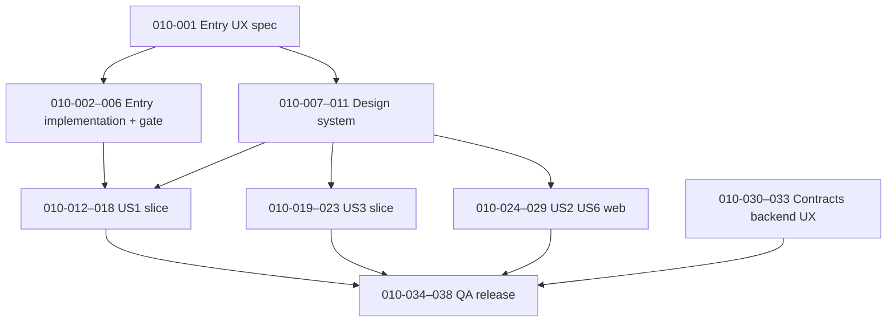

# 14 Tasks — 003 Phase 010: Product UX & UI (backlog)

## Status

Drafted: 2026-04-10 \| Depends on: Phase 009 (T081–T088) **SIGN-OFF: PASS**  
- Phase 010 **010-001** **DONE** (2026-04-10) — Entry UX spec: [funcup-src-docs/02-specs/08-entry-ux-spec-fr012.md](../02-specs/08-entry-ux-spec-fr012.md)  
- Phase 010 **010-002** **DONE** (2026-04-10) — Entry: pierwotny `AnimatedSplash` (`home-print.svg` / `home-bean.svg`) w `apps/frontend` i `apps/web` (`AppOpenGate` w layout); mobile Expo `app/index.tsx` → `/home` (bez duplikacji animacji DOM).  
- Phase 010 **010-003** **DONE** (2026-04-10) — Mobile: `MobileEntrySplash` + reduce-motion branch (`AccessibilityInfo`), SR cues; `app/index.tsx` mounts entry then `replace('/home')`.  
Source of truth (product scenarios): [funcup-src-docs/02-specs/spec.md](funcup-src-docs/02-specs/spec.md)  
Reference style: [funcup-src-docs/04-tasks/13-tasks-002-qr-coffee-platform-88-tasks.md](funcup-src-docs/04-tasks/13-tasks-002-qr-coffee-platform-88-tasks.md)  
Architecture: [funcup-src-docs/02-specs/07-technical-architecture-blueprint-mvp.md](funcup-src-docs/02-specs/07-technical-architecture-blueprint-mvp.md)

**Non-regression (constitution / spec):** Fingerprint-bean entry sequence is **protected** per **FR-012** in `spec.md`. Any change to that sequence requires **explicit approval** (constitution amendment), not a routine PR. **Scope:** that sequence is the **app opening** flow only; UI work elsewhere MUST NOT re-mount or replay it on every route after the shell is active.

---

## Summary

| Phase   | Epic                         | Spec focus        | Tasks        |
|:--------|:-----------------------------|:------------------|:-------------|
| Phase 10 | A — Entry (P0)              | FR-012            | 010-001–010-006 |
| Phase 10 | B — Design system (P1)      | FR cross-cutting  | 010-007–010-011 |
| Phase 10 | C — US1 core journey (P1)   | US1, FR-001–005, FR-011 | 010-012–010-018 |
| Phase 10 | D — US3 hub & discovery (P1)| US3, FR-006–007   | 010-019–010-023 |
| Phase 10 | E — US2 + US6 web (P1)      | US2, US6, FR-013–019, FR-021 | 010-024–010-029 |
| Phase 10 | F — Contracts & backend UX (P2) | FR-011, FR-020, SC-006–008 | 010-030–010-033 |
| Phase 10 | G — QA & release (P2)       | US4, US5, FR-008–009, SC-001–008 (where applicable) | 010-034–010-038 |
| **Total** |                              |                   | **38 tasks** |

---

## Traceability: Epics × User stories (`spec.md`)

Rows name acceptance or test focus; cells note what Phase 010 improves or validates in UX.

| Epic | US1 Scan + Log | US2 Roaster QR | US3 Hub + Discovery | US4 Reputation | US5 Offline | US6 Analytics | Edge cases (spec) |
|:-----|:---------------|:---------------|:--------------------|:---------------|:------------|:--------------|:------------------|
| **A Entry** | **App open** only (before main shell); not repeated per route | — | — | — | — | — | — |
| **B Design system** | Forms, lists, states | Dashboard controls | Hub cards, tabs | Subtle badges | Pending/sync chips | Charts, filters | Consistent error/empty |
| **C US1 journey** | All US1 scenarios + Independent Test | — | — | Community section polish | — | — | Damaged/unknown QR, archived batch, repeat scan |
| **D US3** | — | — | US3 scenarios + Independent Test | — | — | — | Discovery → log without scan |
| **E US2/US6** | — | US2 scenarios + Independent Test | — | — | — | US6 scenarios + Independent Test | Pending verification |
| **F Contracts** | Public page vs auth log | Publish/read models | Discovery data shape | — | Sync errors | Freshness (SC-008) | Revoked verification read-only |
| **G QA** | US1 Independent Test | US2 Independent Test | US3 Independent Test | US4 Independent Test | US5 Independent Test | US6 Independent Test | Full edge-case checklist |

---

## Spec edge cases (UX hooks — do not drop)

From `spec.md` **Edge Cases**; track as acceptance or explicit follow-up tasks:

- Damaged/unreadable QR → “Can’t read code” + optional manual search path.
- Two active batches same coffee → separate QR/tasting pools; UI must not collapse batches.
- Offline queue > device limits → preserve oldest; notify if **50** pending without sync.
- Roaster verification revoked → historical QRs/pages remain; no new publish (messaging).
- Tasting from Discovery without prior scan → log available from coffee page (FR-011 path).
- Reputation advances mid-session → silent update; no toast/modal in tasting flow.

---

## Execution order (recommended)

1. **010-001** (root): lock UX spec for protected entry + a11y fallback rules.
2. **010-002–010-006** in order: mobile entry architecture, a11y path, routing shell, shared contract, **entry gate sign-off**.
3. **010-007–010-011** in parallel with step 2 once **010-001** exists (tokens/primitives do not change FR-012 sequence).
4. **010-012–010-018** after **010-006** and **010-007** (US1 vertical slice on design system).
5. **010-019–010-023** after **010-007** (US3; can overlap with C late tasks if staffing allows).
6. **010-024–010-029** after **010-007** (web dashboard; can parallel with C/D).
7. **010-030–010-033** in parallel with late C/D/E or immediately after first vertical slice needs API clarity.
8. **010-034–010-038** last: full scenario QA + release checklist.

---

## Definition of Done — per vertical slice

### Mobile (`apps/mobile`)

- Slice matches **Independent Test** for the mapped **User Story** in `spec.md` (manual or automated evidence linked in PR).
- **FR-012:** Fingerprint-bean sequence unchanged; only pre/post hooks, timing budgets, and **accessibility / reduced-motion** alternatives are allowed per approved UX spec (**010-001**). The sequence runs **once per app open** (launch into shell), not on each in-app navigation.
- Loading / empty / error states use **010-007–010-011** patterns.
- Touch targets, focus order, and screen reader labels documented or verified for the slice.

### Web (`apps/web`)

- Slice matches **Independent Test** for **US2** and/or **US6** as applicable.
- Forms: validation messages, pending verification (**US2** scenario 5), empty analytics (**US6** scenario 3).
- **FR-018–019:** Review list shows no consumer identifiers; brew filter reflected in UI copy and state.

### Shared (`packages/shared`)

- Hooks/types used by the slice expose **stable loading/error** shapes consumed by mobile and/or web.
- No breaking change without migration note; tests updated for new UX-driven fields if any.

### Backend (`supabase` / Edge Functions)

- Error payloads and HTTP codes map to **user-visible messages** agreed in **010-030–010-032** (no raw stack traces in UI).
- **FR-011 / FR-020:** Public read paths vs authenticated write paths documented; archive preserves tastings.
- Where **SC-008** applies, document expected staleness and any polling/refresh interval for roaster analytics.

### Phase gate (end of Phase 010)

- Traceability table above filled with **PASS** notes and evidence (test names, URLs, or checklist IDs).
- Entry flow **010-006** signed off with explicit “FR-012 unchanged” attestation.

---

## Epic A (P0): Entry experience hardening — **FR-012**

**Scenarios covered:** **App open** is the first touchpoint for all stories (one time per launch into the shell, not on every route). **FR-012** mandates a fixed animation sequence (white screen → fingerprint → tap → confetti → bean → dissolve → main). Phase 010 adds **documented** timing, failure behavior (e.g. asset load), and **accessibility** without altering that sequence.

- [x] **010-001** Author **Entry UX spec** (timing, motion tokens, tap affordance, loading if assets slow, error fallback copy). **Depends:** —. **Surfaces:** mobile (doc), shared (doc). **Deliverable:** [08-entry-ux-spec-fr012.md](../02-specs/08-entry-ux-spec-fr012.md).
- [x] **010-002** [P] **Mobile:** Implement/refactor entry flow module so sequence is isolated (single owner component / route group). **Depends:** 010-001. **Surfaces:** web (Next), Vite (`apps/frontend`). **Deliverable:** `apps/web/components/AnimatedSplash.tsx` (port z `apps/frontend/src/AnimatedSplash.jsx`), `apps/web/public/assets/home-*.svg`, `AppOpenGate` w `app/layout.tsx`; mobile: `app/index.tsx` → `/home`.
- [x] **010-003** [P] **Mobile:** **Reduced motion / accessibility:** alternative path (e.g. static frame + haptic or screen-reader announcement) that does **not** replace or reorder FR-012 steps for default users. **Depends:** 010-001, 010-002. **Surfaces:** mobile.
- [ ] **010-004** **Mobile:** Post-entry routing: cold start → splash **once** → auth stack vs main tabs; document transition and **session rule** (splash must not replay on tab/stack navigation or deep link when app already running). **Depends:** 010-002. **Surfaces:** mobile.
- [ ] **010-005** [P] **Shared:** Document entry **state contract** (e.g. `splashComplete`, `minDisplayMs`) for analytics or future A/B (no behavior change required). **Depends:** 010-001. **Surfaces:** shared.
- [ ] **010-006** **Gate:** Sign-off checklist — FR-012 sequence byte-for-byte storyboard match; video or frame capture; **explicit approval** field if any deviation. **Depends:** 010-002, 010-003, 010-004. **Surfaces:** mobile, shared (checklist in repo or doc link).

---

## Epic B (P1): Design system foundations

**Scenarios covered:** Supports **FR-001–011** (mobile) and **FR-013–019** (web) through consistent interactive patterns; enables **SC-002–SC-007** indirectly (speed, clarity, performance of UI).

- [ ] **010-007** **Design tokens:** color, spacing, radius, elevation, type scale (mobile NativeWind + web Tailwind alignment). **Depends:** 010-001. **Surfaces:** mobile, web, shared (tokens doc or package).
- [ ] **010-008** [P] **Primitives:** Button, TextField, Select/Sheet, Card, ListRow, Chip/Badge. **Depends:** 010-007. **Surfaces:** mobile, web.
- [ ] **010-009** [P] **Patterns:** Skeleton, empty state, inline error, toast/banner policy. **Depends:** 010-007. **Surfaces:** mobile, web.
- [ ] **010-010** **Navigation chrome:** tab bar, header back, modal presentation rules. **Depends:** 010-007. **Surfaces:** mobile (primary); web where applicable.
- [ ] **010-011** **Storybook or preview** (optional web) / **component gallery** doc for mobile — team agreement. **Depends:** 010-008. **Surfaces:** web (optional), doc.

---

## Epic C (P1): US1 — Core consumer journey UI upgrade

**Scenarios covered (from `spec.md` US1):** Scan → Coffee Page **within 5s** (scenario 1); tasting with rating, flavor, brew, optional review → journal (2); archived batch notice (3); repeat scan shows previous tasting + add new (4); unknown QR messaging + share option (5). **Independent Test:** one roaster + one batch + one consumer → scan → log → journal.

**FR mapping:** FR-001, FR-002, FR-003, FR-004, FR-005, FR-011.

- [ ] **010-012** **Mobile:** Scan screen — camera UX, permissions, **damaged QR** empty state (edge case). **Depends:** 010-006, 010-007. **Surfaces:** mobile.
- [ ] **010-013** [P] **Mobile:** Coffee Page — visual hierarchy, four sections (Product, Brewing, Story, Community). **Depends:** 010-006, 010-008. **Surfaces:** mobile.
- [ ] **010-014** [P] **Mobile:** Tasting log form — progressive disclosure, validation, flavor + brew controls. **Depends:** 010-008, 010-009. **Surfaces:** mobile.
- [ ] **010-015** **Mobile:** Journal — chronological list, filters (rating, brew) per **FR-005**. **Depends:** 010-008, 010-009. **Surfaces:** mobile.
- [ ] **010-016** **Mobile:** **Archived / inactive batch** banner (US1 scenario 3). **Depends:** 010-013, 010-030. **Surfaces:** mobile, backend (data flag).
- [ ] **010-017** **Mobile:** **Repeat scan** — surface previous tasting + “add new entry” (US1 scenario 4). **Depends:** 010-013, 010-014. **Surfaces:** mobile, shared.
- [ ] **010-018** **Mobile:** **Unknown QR** — clear copy + optional “share with funcup” (US1 scenario 5). **Depends:** 010-012, 010-030. **Surfaces:** mobile.

---

## Epic D (P1): US3 — Hub & discovery UI upgrade

**Scenarios covered:** Hub **four sections**; Discover Coffees sortable; Roaster profile + **Follow**; Learn articles (US3 scenarios 1–4). **Independent Test:** seeded DB, **≥5 coffees / 3 roasters** recommended for UX review (align seed in separate data task if needed). **FR-006, FR-007.**

- [ ] **010-019** **Mobile:** Hub layout — **Scan Coffee** visually dominant (min ~40% / primary CTA per founding philosophy). **Depends:** 010-006, 010-010. **Surfaces:** mobile.
- [ ] **010-020** [P] **Mobile:** Discover Coffees — cards, sort (newest / most rated), loading/empty. **Depends:** 010-008, 010-009. **Surfaces:** mobile.
- [ ] **010-021** [P] **Mobile:** Discover Roasters — cards → profile. **Depends:** 010-008. **Surfaces:** mobile.
- [ ] **010-022** **Mobile:** Roaster profile — follow CTA, coffee list. **Depends:** 010-021. **Surfaces:** mobile, shared.
- [ ] **010-023** **Mobile:** Learn Coffee — article list + reader typography. **Depends:** 010-008. **Surfaces:** mobile.

---

## Epic E (P1): US2 + US6 — Roaster web dashboard UX upgrade

**Scenarios covered (US2):** Verified flow; create coffee; create batch; **PNG + SVG** QR; pending state; profile edits keep QR stable (US2 scenarios 1–5). **Scenarios (US6):** aggregates, distribution, top flavors, brew filter, empty state, **anonymized** reviews (US6 scenarios 1–4). **FR-013–017, FR-018–019, FR-021.**

- [ ] **010-024** **Web:** Auth screens polish — register/login/pending alignment with **010-007–009**. **Depends:** 010-007. **Surfaces:** web.
- [ ] **010-025** **Web:** Coffee list + create/edit coffee forms — field grouping, validation, archive affordance. **Depends:** 010-008, 010-009. **Surfaces:** web.
- [ ] **010-026** **Web:** Batch create + **QR download** (PNG/SVG) prominence and success feedback. **Depends:** 010-025. **Surfaces:** web.
- [ ] **010-027** **Web:** Analytics route — summary, distribution, top notes, **brew filter**, review list **no PII**. **Depends:** 010-008, 010-009. **Surfaces:** web, shared.
- [ ] **010-028** [P] **Web:** Empty analytics — guidance to promote QR (US6 scenario 3). **Depends:** 010-027. **Surfaces:** web.
- [ ] **010-029** **Web:** Dashboard navigation + responsive layout for core roaster tasks. **Depends:** 010-007. **Surfaces:** web.

---

## Epic F (P2): Shared contracts & backend UX support

**Scenarios covered:** **FR-011** public coffee view vs auth log; **FR-020** archive semantics; **SC-006–008** where UX needs reliable errors and freshness.

- [ ] **010-030** **Shared + doc:** Map **scan_qr** / coffee page errors to **UI copy** matrix. **Depends:** —. **Surfaces:** shared, backend (functions), mobile.
- [ ] **010-031** [P] **Backend:** Ensure responses include flags for **inactive batch**, **duplicate log hints** if product requires (coordinate with 010-016, 010-017). **Depends:** 010-030. **Surfaces:** backend, shared.
- [ ] **010-032** **Backend:** Rate-limit / abuse responses user-safe (no internals). **Depends:** 010-030. **Surfaces:** backend.
- [ ] **010-033** **Web + backend:** Roaster analytics **refresh** behavior documented; implement polling or tag invalidation to approach **SC-008**. **Depends:** 010-027. **Surfaces:** web, backend.

---

## Epic G (P2): QA, accessibility, release readiness

**Scenarios covered:** **US4** silent level + Expert label (**FR-008**); **US5** offline cache, pending sync, auto sync **30s** (**FR-009**); **SC-001–008** where measurable in Phase 010.

- [ ] **010-034** **Mobile:** **US4** UX audit — no progress bars, no unlock toasts; profile + Community subtle Expert. **Depends:** 010-013. **Surfaces:** mobile.
- [ ] **010-035** **Mobile:** **US5** UX audit — cached page readable offline, pending indicator, sync clears within **30s** of reconnect (manual or device test). **Depends:** 010-015. **Surfaces:** mobile.
- [ ] **010-036** **Cross:** WCAG-oriented pass (contrast, labels, focus) on touched screens. **Depends:** 010-012–010-029. **Surfaces:** mobile, web.
- [ ] **010-037** **Cross:** Performance sanity — image sizes, list virtualization where needed (**SC-007** journal). **Depends:** 010-015. **Surfaces:** mobile.
- [ ] **010-038** **Release:** Phase 010 sign-off — run **Independent Tests** US1–US6 from `spec.md`; attach evidence; update traceability table status. **Depends:** 010-006, 010-018, 010-023, 010-029, 010-033, 010-036. **Surfaces:** all.

---

## Independent test criteria quick reference (`spec.md`)

| Story | Verify |
|:------|:-------|
| US1 | QR → Coffee Page (4 sections) → log → journal |
| US2 | Web: coffee → batch → QR download → resolve |
| US3 | Hub browse, roaster profile, follow, learn — no scan |
| US4 | Silent reputation; Expert label in Community |
| US5 | Offline queue → reconnect sync ≤ 30s |
| US6 | Mock tastings → stats + brew filter; anonymized reviews |

---

## Notes

- **FR-012 / mobile:** The fingerprint–confetti–bean flow is **only** the opening sequence when the app is entered from launch; all other screens use normal navigation UX—do not treat the splash as a per-route transition.
- **Web consumer** (`/q/{hash}`) may share patterns with mobile but is not required to duplicate the **FR-012** native entry animation; if a web landing exists, define a separate minimal branded splash that does not claim FR-012 parity unless approved.
- Phase 010 is **UX/UI productization**; it assumes Phase 009 functional completeness unless tasks **010-031–010-033** uncover intentional API gaps.
