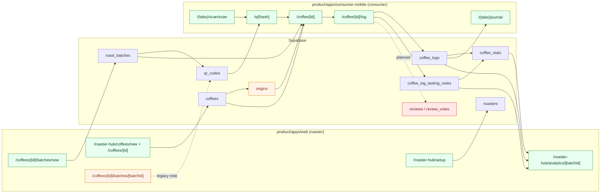
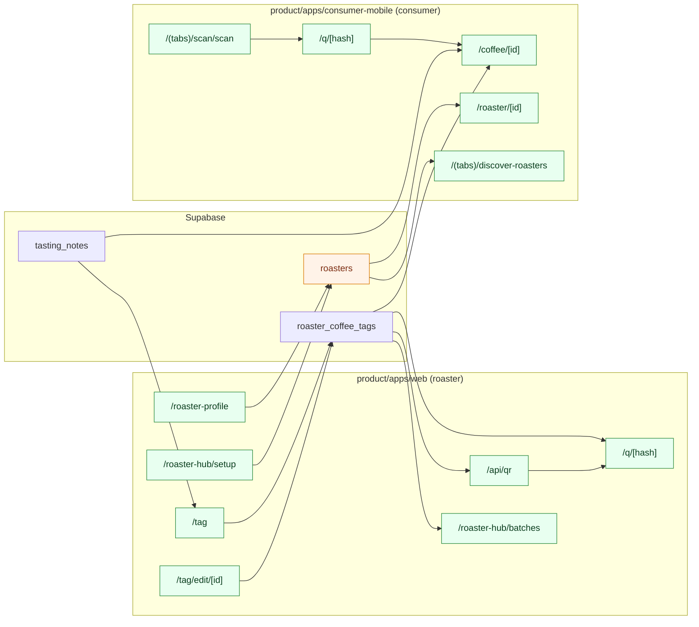
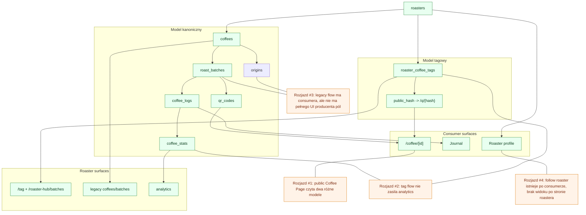

# Audyt przepływów danych `funcup` między `product/apps/web` i `product/apps/consumer-mobile`

## Cel
Ten dokument porządkuje przepływy danych między aplikacją roastera `product/apps/web` i aplikacją consumera `product/apps/consumer-mobile`.

Audyt obejmuje dwa równoległe modele obecne w repo:

- model kanoniczny: `roasters -> coffees -> roast_batches -> qr_codes -> coffee_logs -> coffee_stats`
- model tagowy: `roasters -> roaster_coffee_tags -> /q/{public_hash} -> Coffee Page`

## Wnioski główne

- Repo zawiera dwa aktywne, ale niespójne nurty produktu: pełny model `coffee/batch/log/analytics` i uproszczony model `roaster_coffee_tags`.
- Najlepiej domknięty cross-app flow to dziś: `roaster-profile/setup -> tag -> api/qr -> /q/[hash] -> mobile coffee/[id]`.
- Największe rozdarcie występuje w legacy flow: `coffees`, `roast_batches`, `qr_codes` są czytane przez mobile i analytics, ale web nie ma pełnego UI do zasilania pól takich jak `origin`, `cover_image_url`, `brewing_notes`, `roaster_story`.
- Największa luka cross-role po stronie biznesowej to follow relacja consumer → roaster: consumer zapisuje follow, ale web nie pokazuje tego roasterowi w batch managerze, mimo że to jest ważny przyszły use case handlowy.
- Część ekranów jest świadomie jednostronna i nie powinna być traktowana jako błąd: auth, biometria, reset hasła, onboarding, edukacja, entry screens.

## Tabela UML: pary ekranów

| ID | Web route | Mobile route | Wspólny obiekt danych | Tabele/pola | Kierunek przepływu | Status | Uwagi |
|---|---|---|---|---|---|---|---|
| P01 | `/` | `/index`, `/home` | entry/auth dispatch | sesja auth | system -> system | `direct pair` | Obie strony rozdzielają wejście od właściwej nawigacji. |
| P02 | `/(auth)/login` | `/(auth)/login-form` | auth sign-in | Supabase Auth session | consumer/web input -> session | `direct pair` | Web i mobile mają ten sam cel, ale mobile ma dodatkowy ekran-pośrednik `/(auth)/login`. |
| P03 | `/(auth)/register` | `/(auth)/register` | auth sign-up | Supabase Auth user | input -> auth | `direct pair` | Mobile po rejestracji przechodzi dalej do `complete-profile`. |
| P04 | `/scan` | `/(tabs)/scan/scan` | wejście do QR flow | payload QR -> `hash` | scan -> `/q/[hash]` | `pipeline pair` | Web screen jest tylko placeholderem, mobile ma realny skaner. |
| P05 | `/q/[hash]` | `/q/[hash]` | deep link resolver | `hash`, `scan_qr` | hash -> resolver | `direct pair` | Web renderuje wynik, mobile tylko przepisuje na `/coffee/[id]`. |
| P06 | `/q/[hash]` | `/coffee/[id]` | public coffee object | `roaster_coffee_tags.*` lub `qr_codes` join | web/mobile read | `direct pair` | To jest główny publiczny punkt styku modeli z consumerem. |
| P07 | `/roaster-hub/setup` | `/(tabs)/discover-roasters`, `/roaster/[id]` | minimalny roaster record | `roasters.id`, `name` | web input -> mobile discovery | `pipeline pair` | Setup web tworzy minimalny wpis, który może trafić do discovery. |
| P08 | `/roaster-profile` | `/roaster/[id]` | public/private roaster profile | `roasters.name`, `roaster_short_name`, `city`, `website` | web input -> mobile read | `pipeline pair` | Mobile czyta publiczną wersję profilu, web edytuje prywatny rekord roastera. |
| P09 | `/tag` | `/coffee/[id]` | tag produktu kawowego | `roaster_coffee_tags.*` | web input -> mobile read | `direct pair` | Najbardziej spójny obecnie flow produktowy. |
| P10 | `/tag/edit/[id]` | `/coffee/[id]` | aktualizacja tagu | `roaster_coffee_tags.*` | web update -> mobile read | `direct pair` | Edycja zachowuje ten sam obieg publiczny przez `public_hash`. |
| P11 | `/roaster-hub/batches` | `/coffee/[id]` | batch manager roastera | `coffees`, `roast_batches`, `qr_codes` | web read/manage -> mobile read | `pipeline pair` | Route zarządza kanonicznymi batchami, które consumer czyta przez public coffee flow. |
| P12 | `/api/qr` | `/q/[hash]`, `/coffee/[id]` | generator identyfikatora publicznego | `roaster_coffee_tags.public_hash` | private generate -> public resolve | `bridge` | API route scala prywatny rekord roastera z publicznym adresem `/q/{hash}`. |
| P13 | `/roaster-hub/coffees/new` | `/coffee/[id]` | coffee entity w modelu legacy | `coffees.id`, `name`, `status` | web input -> mobile read | `pipeline pair` | UI tworzy tylko rdzeń `coffee`; reszta pól nie ma producenta w web. |
| P14 | `/roaster-hub/coffees/[id]` | `/coffee/[id]` | coffee details w legacy flow | `coffees.*` | web read/manage -> mobile read | `pipeline pair` | Para istnieje na poziomie encji, ale nie na poziomie pełnego zakresu pól. |
| P15 | `/roaster-hub/coffees/[id]/batches/new` | `/coffee/[id]`, `/coffee/[id]/log` | batch identity | `roast_batches.id`, `lot_number`, `roast_date` | web input -> mobile tasting | `pipeline pair` | Tworzenie batcha jest warunkiem późniejszego logowania degustacji. |
| P16 | `/roaster-hub/coffees/[id]/batches/[batchId]` | `/coffee/[id]`, `/coffee/[id]/log` | batch context | `roast_batches.*` | batch -> qr/log | `pipeline pair` | Ekran web sygnalizuje, że QR generation przeniesiono do `/tag`, co ujawnia rozjazd modeli. |
| P17 | `/roaster-hub/analytics/[batchId]` | `/coffee/[id]/log`, `/(tabs)/journal` | user feedback i agregaty | `coffee_logs`, `coffee_log_tasting_notes`, `coffee_stats` | mobile input -> web analytics | `direct pair` | To jest najważniejsza para roaster <- consumer w modelu kanonicznym. |
| P18 | `/roaster-hub` | `/(tabs)/hub` | role dashboard | sesja + profil roli | system nav | `same-side only` | Ekrany mają podobną funkcję nawigacyjną, ale prowadzą do innych światów domenowych. |

## Tabela UML: pełna klasyfikacja route files

### `product/apps/web`

| Route file | Rola | Typ | Model danych | Counterpart | Status | Uwagi |
|---|---|---|---|---|---|---|
| `app/page.tsx` | `shared/system` | `bridge` | auth session | `mobile app/index.tsx`, `mobile app/home.tsx` | `direct pair` | Root dispatch po sesji. |
| `app/(auth)/login/page.tsx` | `shared/system` | `input` | auth | `mobile app/(auth)/login-form.tsx` | `direct pair` | |
| `app/(auth)/register/page.tsx` | `shared/system` | `input` | auth | `mobile app/(auth)/register.tsx` | `direct pair` | |
| `app/(auth)/pending/page.tsx` | `shared/system` | `read` | auth verification | `—` | `same-side only` | Brak odpowiednika mobile. |
| `app/scan/page.tsx` | `shared/system` | `bridge` | qr payload | `mobile app/(tabs)/scan/scan.tsx` | `orphan-risk` | Web nie skanuje, tylko komunikuje intencję. |
| `app/q/[hash]/page.tsx` | `shared/system` | `bridge/read` | `scan_qr` result | `mobile app/q/[hash].tsx`, `mobile app/coffee/[id]/index.tsx` | `direct pair` | |
| `app/roaster-hub/page.tsx` | `roaster` | `read/nav` | `roasters` | `mobile app/(tabs)/hub/index.tsx` | `same-side only` | |
| `app/roaster-hub/setup/page.tsx` | `roaster` | `input` | `roasters.user_id`, `name` | `mobile app/(tabs)/discover-roasters/index.tsx`, `mobile app/roaster/[id]/index.tsx` | `pipeline pair` | |
| `app/roaster-profile/page.tsx` | `roaster` | `input/read` | `roasters.company_name`, `roaster_short_name`, `city`, `website` | `mobile app/roaster/[id]/index.tsx` | `pipeline pair` | |
| `app/tag/page.tsx` | `roaster` | `input` | `roaster_coffee_tags.*` | `mobile app/coffee/[id]/index.tsx` | `direct pair` | |
| `app/tag/edit/[id]/page.tsx` | `roaster` | `input/update` | `roaster_coffee_tags.*` | `mobile app/coffee/[id]/index.tsx` | `direct pair` | |
| `app/roaster-hub/batches/page.tsx` | `roaster` | `read/manage` | `coffees`, `roast_batches`, `qr_codes` | `mobile app/coffee/[id]/index.tsx` | `pipeline pair` | |
| `app/api/qr/route.ts` | `shared/system` | `transform` | `roaster_coffee_tags.public_hash` | `mobile app/q/[hash].tsx` | `bridge` | |
| `app/roaster-hub/coffees/new/page.tsx` | `roaster` | `input` | `coffees.name`, `status` | `mobile app/coffee/[id]/index.tsx` | `pipeline pair` | Legacy CRUD. |
| `app/roaster-hub/coffees/[id]/page.tsx` | `roaster` | `read` | `coffees.id`, `name`, `status` | `mobile app/coffee/[id]/index.tsx` | `pipeline pair` | Legacy CRUD. |
| `app/roaster-hub/coffees/[id]/batches/new/page.tsx` | `roaster` | `input` | `roast_batches.lot_number`, `roast_date` | `mobile app/coffee/[id]/log.tsx` | `pipeline pair` | Legacy CRUD. |
| `app/roaster-hub/coffees/[id]/batches/[batchId]/page.tsx` | `roaster` | `read` | `roast_batches.id` | `mobile app/coffee/[id]/log.tsx` | `pipeline pair` | Legacy CRUD. |
| `app/roaster-hub/analytics/[batchId]/page.tsx` | `roaster` | `read/transform` | `coffee_logs`, `coffee_stats` | `mobile app/coffee/[id]/log.tsx`, `mobile app/(tabs)/journal/index.tsx` | `direct pair` | |

### `product/apps/consumer-mobile`

| Route file | Rola | Typ | Model danych | Counterpart | Status | Uwagi |
|---|---|---|---|---|---|---|
| `app/index.tsx` | `shared/system` | `bridge` | entry only | `web app/page.tsx` | `direct pair` | Entry splash. |
| `app/home.tsx` | `shared/system` | `read/nav` | none | `web app/page.tsx` | `same-side only` | Shell test/staging. |
| `app/+native-intent.tsx` | `shared/system` | `bridge` | path rewrite | `web app/q/[hash]/page.tsx` | `direct pair` | System-level deep link repair. |
| `app/(auth)/login.tsx` | `shared/system` | `bridge` | auth state, biometrics | `—` | `same-side only` | Mobile-only lock/unlock dispatcher. |
| `app/(auth)/login-form.tsx` | `shared/system` | `input` | auth | `web app/(auth)/login/page.tsx` | `direct pair` | |
| `app/(auth)/register.tsx` | `shared/system` | `input` | auth + bootstrap metadata | `web app/(auth)/register/page.tsx` | `direct pair` | |
| `app/(auth)/forgot-password.tsx` | `shared/system` | `input` | auth reset | `—` | `same-side only` | Web odpowiednik nie istnieje. |
| `app/(auth)/reset-password.tsx` | `shared/system` | `input` | auth reset | `—` | `same-side only` | Web odpowiednik nie istnieje. |
| `app/(auth)/complete-profile.tsx` | `consumer` | `input` | `users`, `user_favorite_flavor_notes` | `—` | `same-side only` | Consumer onboarding nie ma web odpowiednika. |
| `app/(tabs)/hub/index.tsx` | `consumer` | `read/nav` | none | `web app/roaster-hub/page.tsx` | `same-side only` | Hub konsumenta, nie panel roastera. |
| `app/(tabs)/discover-roasters/index.tsx` | `consumer` | `read` | `roasters` | `web app/roaster-profile/page.tsx`, `web app/roaster-hub/setup/page.tsx` | `pipeline pair` | Czyta rekordy zasilane przez web. |
| `app/(tabs)/brew-your-skills/index.tsx` | `consumer` | `read` | static | `—` | `same-side only` | Edukacja/placeholder. |
| `app/(tabs)/journal/index.tsx` | `consumer` | `read` | `coffee_logs`, joins to legacy product model | `web app/roaster-hub/analytics/[batchId]/page.tsx` | `direct pair` | |
| `app/(tabs)/profile/index.tsx` | `consumer` | `input/read` | `users`, `user_favorite_flavor_notes` | `—` | `same-side only` | Consumer account/profile. |
| `app/(tabs)/scan/scan.tsx` | `consumer` | `bridge` | qr payload -> `hash` | `web app/scan/page.tsx` | `pipeline pair` | Mobile ma pełną implementację. |
| `app/q/[hash].tsx` | `shared/system` | `bridge` | `hash` | `web app/q/[hash]/page.tsx` | `direct pair` | Redirect do Coffee Page. |
| `app/coffee/[id]/index.tsx` | `consumer` | `read` | `roaster_coffee_tags` lub legacy `qr_codes` join | `web app/tag/page.tsx`, `web app/roaster-hub/batches/page.tsx`, `web app/roaster-hub/coffees/[id]/page.tsx` | `direct pair` | Publiczny czytnik obu modeli. |
| `app/coffee/[id]/log.tsx` | `consumer` | `input` | `coffee_logs` | `web app/roaster-hub/analytics/[batchId]/page.tsx` | `direct pair` | Najważniejszy feedback flow. |
| `app/roaster/[id]/index.tsx` | `consumer` | `read/input` | `roasters`, `user_roaster_follows` | `web app/roaster-profile/page.tsx` | `pipeline pair` | Consumer czyta roastera i zapisuje follow. |
| `app/learn/[slug].tsx` | `consumer` | `read` | static article content | `—` | `same-side only` | Brak web odpowiednika. |
| `app/test-select-user.tsx` | `shared/system` | `bridge/mock` | none | `—` | `orphan` | Ekran testowy/mock, nie ma partnera domenowego. |

## Tabela UML: osierocone pliki

Poniższa tabela obejmuje pliki bez realnego pokrycia w drugiej aplikacji albo z bardzo słabym pokryciem wynikającym z rozjazdu modeli.

| ID | Plik | Typ | Model danych | Dlaczego osierocony | Proponowana para / decyzja |
|---|---|---|---|---|---|
| O01 | `product/apps/web/app/scan/page.tsx` | route | shared/system | Web nie skanuje, tylko pokazuje komunikat; mobile ma pełny skaner i parser QR. | Albo rozbudować do realnego web scanner flow, albo jawnie oznaczyć jako info-only. |
| O02 | `product/apps/web/app/roaster-hub/coffees/new/page.tsx` | route | legacy canonical | Tworzy tylko `coffees.name` i `status`; brak pary po stronie tagowego flow i brak pełnego producenta pól czytanych przez mobile. | Zachować tylko jeśli model legacy zostaje rozwijany; inaczej zwinąć do migracji na `tag`. |
| O03 | `product/apps/web/app/roaster-hub/coffees/[id]/page.tsx` | route | legacy canonical | Ekran czyta minimalny rekord `coffees`, ale nie domyka publicznego produktu jak `tag`/`roaster-hub/batches`. | Zintegrować z pełnym edytorem legacy albo wygasić na rzecz `roaster_coffee_tags`. |
| O04 | `product/apps/web/app/roaster-hub/coffees/[id]/batches/new/page.tsx` | route | legacy canonical | Tworzy tylko `lot_number` i `roast_date`; batch ma pola czytane przez mobile, których nikt nie edytuje. | Rozbudować o `brewing_notes` i `roaster_story` albo zamrozić jako legacy. |
| O05 | `product/apps/web/app/roaster-hub/coffees/[id]/batches/[batchId]/page.tsx` | route | legacy canonical | Sam ekran mówi, że QR generation przeniesiono do `/tag`, więc jest częścią niespójnego flow. | Uczynić z niego pełny batch manager albo usunąć po migracji. |
| O06 | `product/apps/consumer-mobile/app/(tabs)/brew-your-skills/index.tsx` | route | static | Brak odpowiednika w web i brak sprzężenia z danymi roaster/consumer. | Zostawić jako consumer-only, nie traktować jako bug. |
| O07 | `product/apps/consumer-mobile/app/learn/[slug].tsx` | route | static | Edukacja żyje tylko po stronie mobile; web nie publikuje tych treści. | Zostawić jako consumer-only albo zbudować publiczny web knowledge layer. |
| O08 | `product/apps/consumer-mobile/app/(auth)/forgot-password.tsx` | route | auth | Brak odpowiednika web. | Zostawić jako mobile-only auth utility. |
| O09 | `product/apps/consumer-mobile/app/(auth)/reset-password.tsx` | route | auth | Brak odpowiednika web. | Zostawić jako mobile-only auth utility. |
| O10 | `product/apps/consumer-mobile/app/test-select-user.tsx` | route | mock/system | Route testowy, nie należy do produktu domenowego. | Usunąć z buildów produkcyjnych albo schować za dev flagą. |
| O11 | `product/apps/consumer-mobile/app/home.tsx` | route | shell/staging | Scaffold navigation, nie ma wyraźnego partnera domenowego. | Zdecydować: shell developerski albo właściwy home konsumenta. |
| O12 | `product/apps/consumer-mobile/app/+native-intent.tsx` | meta-route | shared/system | Nie ma dosłownej pary w web jako plik; to techniczny klej deep-linków. | Zostawić jako technical bridge. |
| O13 | `product/apps/web/app/(auth)/pending/page.tsx` | route | auth | Web-only verification holding screen, mobile po rejestracji idzie innym flow. | Zostawić jako web-only. |

## Tabela UML: osierocone pola danych

Poniżej są tylko pola z luką w obiegu. Pola nieujęte w tej tabeli mają działającego producenta i konsumenta albo są wyłącznie techniczne.

| Tabela / pole | Producent | Konsument | Status | Rekomendacja |
|---|---|---|---|---|
| `roasters.company_name` | `web /roaster-profile` | brak w mobile | `orphan cross-app` | Jeśli consumer ma widzieć nazwę rejestrową, dodać publiczną prezentację; jeśli nie, uznać za backoffice-only. |
| `roasters.street` | brak aktywnego UI | brak | `dead/backoffice` | Albo dodać formularz i użycie, albo usunąć z produktu publicznego. |
| `roasters.building_number` | brak aktywnego UI | brak | `dead/backoffice` | Jak wyżej. |
| `roasters.apartment_number` | brak aktywnego UI | brak | `dead/backoffice` | Jak wyżej. |
| `roasters.postal_code` | brak aktywnego UI | brak | `dead/backoffice` | Jak wyżej. |
| `roasters.regon` | brak aktywnego UI | brak | `dead/backoffice` | Pole prawno-rejestrowe bez obiegu poza kontekstem komercjalizacji. |
| `roasters.nip` | brak aktywnego UI | brak | `dead/backoffice` | Jak wyżej. |
| `roasters.subscription_status` | częściowo `web /roaster-profile` read-only | brak w mobile | `orphan cross-app` | Zdecydować: panel billing/backoffice albo usunięcie z produktu użytkowego. |
| `roasters.description` | brak aktywnego UI w web | `mobile discover hooks` oczekują pola | `producer gap` | Dodać edycję opisu po stronie roastera. |
| `roasters.country` | brak aktywnego UI w web | `mobile discover hooks`, `scan_qr` | `producer gap` | Dodać do profilu roastera albo usunąć z konsumenta. |
| `roasters.logo_url` | brak aktywnego UI w web | `scan_qr` zwraca, ale UI prawie nie używa | `producer gap` | Dodać upload logo i jawne użycie w mobile. |
| `roasters.verification_status` | brak UI roastera; tylko schema/filter | `mobile discover roasters` filtruje verified | `operational gap` | Potrzebny admin/backoffice workflow weryfikacji. |
| `user_roaster_follows` | `mobile /roaster/[id]`, `mobile /(tabs)/roasters` | brak web roaster view | `orphan cross-role` | Dodać widok followerów/favorites w `batch managerze` lub analytics. |
| `users.favorite_brew_method_id` | `mobile complete-profile/profile` | brak web | `same-side only` | Zostawić consumer-only albo wykorzystać w ofertach/rekomendacjach roastera. |
| `user_favorite_flavor_notes.tasting_note_id` | `mobile complete-profile/profile` | brak web | `same-side only` | Jak wyżej. |
| `users.sensory_score` | backend `update_coffee_stats` | `mobile profile` | `same-side only` | Web może używać do segmentacji feedbacku, dziś nie używa. |
| `users.sensory_level` | backend derive | `mobile profile` | `same-side only` | Jak wyżej. |
| `coffees.origin_id` | brak aktywnego UI web | `scan_qr` -> mobile `coffee/[id]` | `producer gap` | Dodać edycję origin w legacy CRUD albo wygasić model legacy. |
| `coffees.variety` | brak aktywnego UI web | `mobile coffee/[id]` batch path | `producer gap` | Jak wyżej. |
| `coffees.processing_method` | brak aktywnego UI web | `mobile coffee/[id]` batch path, discovery | `producer gap` | Jak wyżej. |
| `coffees.producer_notes` | brak aktywnego UI web | `mobile coffee/[id]` batch path | `producer gap` | Jak wyżej. |
| `coffees.cover_image_url` | brak aktywnego UI web | `scan_qr` payload | `producer gap` | Dodać cover image w legacy CRUD albo wygasić model. |
| `origins.country/region/farm/altitude_min/altitude_max/producer` | brak aktywnego UI web | `scan_qr` payload | `producer gap` | Legacy model ma consumera, ale nie ma roaster UI do zasilenia origin. |
| `roast_batches.brewing_notes` | brak aktywnego UI web | `mobile coffee/[id]` batch path | `producer gap` | Dodać edycję batch narrative. |
| `roast_batches.roaster_story` | brak aktywnego UI web | `mobile coffee/[id]` batch path | `producer gap` | Jak wyżej. |
| `qr_codes.hash` | seed/backend/functions | `mobile discover`, `scan_qr` | `legacy bridge only` | Brak aktywnego UI tworzenia QR po stronie web legacy; dziś zastępuje go `public_hash` w tagach. |
| `qr_codes.qr_url/svg_storage_path/png_storage_path` | backend/functions | brak aktywnego UI w appach | `backend-only orphan-risk` | Albo przywrócić aktywne pobieranie QR dla batchy, albo uznać legacy. |
| `coffee_logs.brew_method_id` | API wspiera, ale mobile log UI nie podaje wartości | `web analytics` filtr, backend stats | `producer gap` | Podłączyć `BrewMethodPicker` do submit payload. |
| `coffee_logs.brew_time_seconds` | API wspiera, UI nie wysyła | brak realnego UI read | `orphan` | Dodać pole czasu parzenia albo usunąć z MVP. |
| `coffee_logs.free_text_notes` | API wspiera, UI nie wysyła | `mobile journal` umie czytać | `producer gap` | Podłączyć pole notatek do `coffee/[id]/log`. |
| `coffee_log_tasting_notes.tasting_note_id` | API wspiera, `FlavorNoteSelector` jest placeholderem | `web analytics` czyta | `producer gap` | Podłączyć selektor tasting notes do submit payload. |
| `reviews.body` | API wspiera `review`, UI nie wysyła | brak aktywnego UI read | `orphan` | Albo włączyć community reviews, albo usunąć z MVP. |
| `review_votes.*` | brak UI write | brak UI read | `orphan` | Funkcja społecznościowa nieuruchomiona. |
| `flavor_notes.*` | migracja/fallback only | fallback readers w web/mobile | `shadow legacy` | Docelowo usunąć po pełnej migracji na `tasting_notes`. |

## Diagram: model kanoniczny `coffee / batch / log / analytics`

## Diagram: model tagowy `roaster_profile / tag / qr / coffee page`

## Diagram zbiorczy: rozjazd modeli

## Decyzje produktowo-architektoniczne wymuszone przez audyt

1. Trzeba zdecydować, czy `roaster_coffee_tags` jest:
   - tymczasowym skrótem do MVP,
   - czy docelowym publicznym produktem niezależnym od `coffees` i `roast_batches`.

2. Jeśli model kanoniczny zostaje:
   - web musi dostać brakujące formularze dla `origins`, `coffees.variety/processing_method/producer_notes/cover_image_url`, `roast_batches.brewing_notes/roaster_story`,
   - mobile `coffee/[id]/log` musi zacząć realnie wysyłać `brew_method_id`, `free_text_notes`, `tasting_note_ids`, opcjonalnie `review`.

3. Jeśli model tagowy ma być dominujący:
   - trzeba zdefiniować, jak z `roaster_coffee_tags` powstają dane do feedback loop i analytics,
   - bo dziś `tag` prowadzi do Coffee Page, ale nie do roaster analytics.

4. `user_roaster_follows` powinno dostać webowego konsumenta:
   - minimum: licznik followersów / favorites w `batch managerze`,
   - docelowo: segmentacja ofert handlowych zgodnie z założeniem produktu.

## Minimalna mapa implementacyjna po audycie

- Ścieżka A: zunifikować publiczny Coffee Page wokół jednego modelu produktu.
- Ścieżka B: domknąć feedback loop `consumer log -> roaster analytics`.
- Ścieżka C: zdecydować, które pola `roasters` są publiczne, a które backoffice-only.
- Ścieżka D: usunąć lub ukryć route’y testowe i scaffoldingowe w buildzie produkcyjnym.
